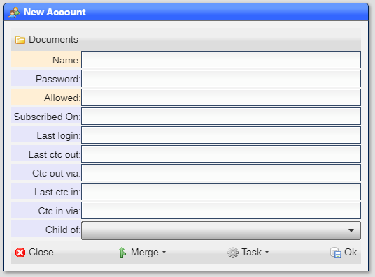

# Accounts

An account is a login that uses an email address or phone number as the identifier:

---

|Field|Meaning|
|-|-|
|Name|EMail or phone number that is the name used at log in|
|Password|Password used at login (case sensitive)|
|Allowed|Dtasets allowed for the user (see below)|
|Subscribed On|Date and time that the account subscribed|
|Last login|Date and time that the account logged in|
|Last ctc out|Date and time that the account was contacted|
|Ctc out via|Method in which the account was contacted|
|Last ctc in|Date and time that the account contacted us|
|Ctc in via|Method in which the account contacted us|
|Child of|User that is related to the account|

## Enabling accounts

Accounts are enabled via the [Site Settings](README_SITE.md) tool, ***System*** tab.

## Uses

An account has multiple uses:

1) A login into the system
2) A billable entity
3) A contactable entity

### As a login

An account can be used to login into the system just like any user would.  For this case, the ***password*** and ***allowed*** fields are used.  The ***allowed*** field should have ***?ACCT*** to identify the account as an external account which limits access to certain functionality.

### As a billable entity

An account can be used to create invoices.  You need to enable billing in the [Site Settings](README_SITE.md) tool, ***System*** tab.

### As a contactable entity

You can EMail, SMS or call an account, which triggers ***outbound telemetry*** information.  When an account SMS, calls or clicks on any ***inbound telemetry*** link, the contact is added into the ***inbound telemetry*** fields.

## Allowed

The allowed field is the same as in the [Users](README_USERS.md) tool.

You can right mouse click on an ***allowed*** field and select ***Explain*** to get a breakdown on what the
rules given will provide.

[Home](../README.md)
