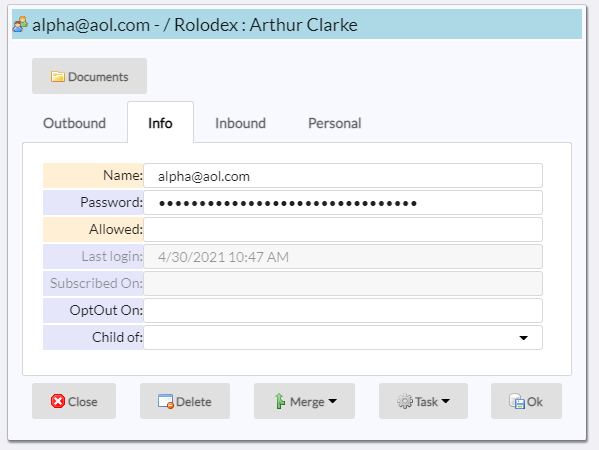
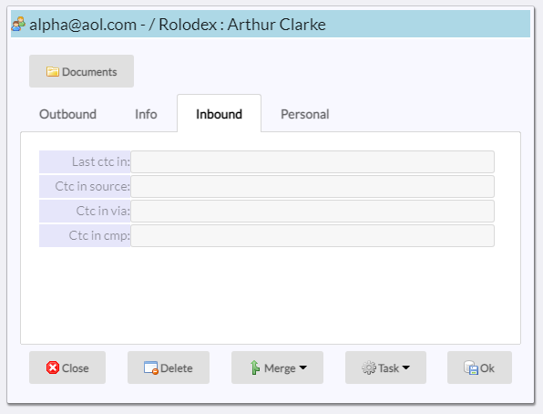
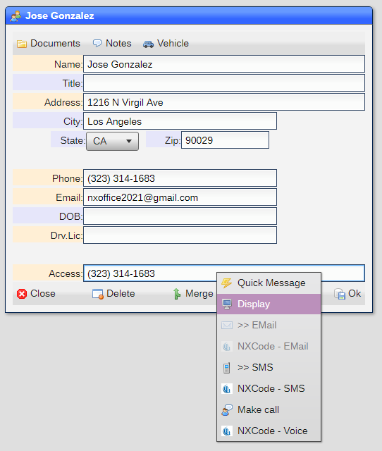

# Accounts

An account is a login that uses an email address or phone number as the identifier.  While [users](README_USERS.md)
are ***inhouse personnel*** , accounts are ***external entities***.

Accounts are the central dataset to [billing](README_BILLING.md) and [telemetry](README_TELEMETRY.md).  Accounts
are also ***virtual users*** when you choose and carry the same dataset rules.



---

|Field|Meaning|
|-|-|
|Name|EMail or phone number that is the name used at log in|
|Password|Password used at login (case sensitive)|
|Allowed|Dtasets allowed for the user (see below)|
|Last login|Date and time that the account logged in|
|Subscribed On|Date and time that the account subscribed|
|Opt Out On|Date and time that the account opted out|
|Child of|User that is related to the account|

---


|Field|Meaning|
|-|-|
|Full name|Full name of person of entity|
|Address|Mailing address|
|City|City|
|State|State|
|ZIP|ZIP code|

---


|Field|Meaning|
|-|-|
|Last ctc out|Date and time that the account was contacted|
|Ctc out source|Source in which the account was contacted|
|Ctc out via|Method in which the account was contacted|
|Ctc out cmp|Cmpaign in which the account was contacted|

---



|Field|Meaning|
|-|-|
|Last ctc in|Date and time that the account was contacted|
|Ctc in source|Source in which the account was contacted|
|Ctc in via|Method in which the account was contacted|
|Ctc in cmp|Cmpaign in which the account was contacted|

## Configuring accounts

Accounts are always enabled but you set configuration parameters in the [Site Settings](README_SITE.md) tool:


|Field|Meaning|
|-|-|
|Acct.Def.Alwd|Default [allowed](README_USERS.md).  Note that ```?ACCT``` is automatically prepended|
|Acct.Mirror|Dataset that mirrors certain account fields|
|Mirror Map|List of target/source field paris from the ***Account*** dataset to the mirror dataset|

```NOTE: If you are planning on using the system as a billing system and allow for dynamic creation of accounts, 
you must set the ***mirror settings***, otherwise you will have to manually use the automatic account creation (below) 
which will create duplicate account entries and a maintenance issue.```

## Automatic account creation

Accounts are automatically created and maintained when an ***account*** field is included in a dataset.  
The field labeled ***Access*** in this dataset is an example:



Account fields allow for the display of the account dataset by using the ***Display*** entry in the options menu, accessible by
right-mouse click on the field.

## Creation via Subscribe

You can include a ```Subscribe``` button in an [EMail Template](README_EMT.md) and when the user clicks on it an account
is created.  If a ***mirror dataset*** is defined, an entry will be created in that dataset.

## Uses

An account has multiple uses:

1) A login into the system
2) A billable entity
3) A contactable entity

### As a login

An account can be used to login into the system just like any user would.  For this case, the ***password*** and ***allowed*** fields are used.  The ***allowed*** field should have ***?ACCT*** to identify the account as an external account which limits access to certain functionality.

### As a billable entity

An account can be used to create invoices.  You need to enable billing in the [Site Settings](README_SITE.md) tool, ***System*** tab.

### As a contactable entity

You can EMail, SMS or call an account, which triggers ***outbound telemetry*** information.  When an account SMS, calls or clicks on any ***inbound telemetry*** link, the contact is added into the ***inbound telemetry*** fields.  You need to enable telemetry in the [Site Settings](README_SITE.md) tool, ***System*** tab.

## Allowed

The allowed field is the same as in the [Users](README_USERS.md) tool.

You can right mouse click on an ***allowed*** field and select ***Explain*** to get a breakdown on what the
rules given will provide.

[Home](../README.md)
