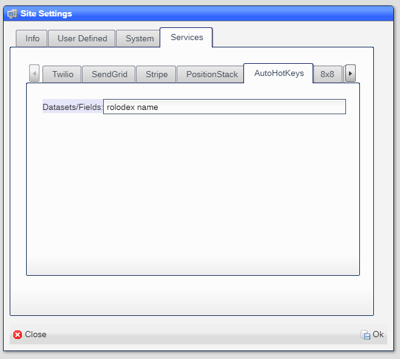
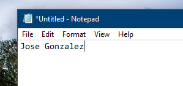
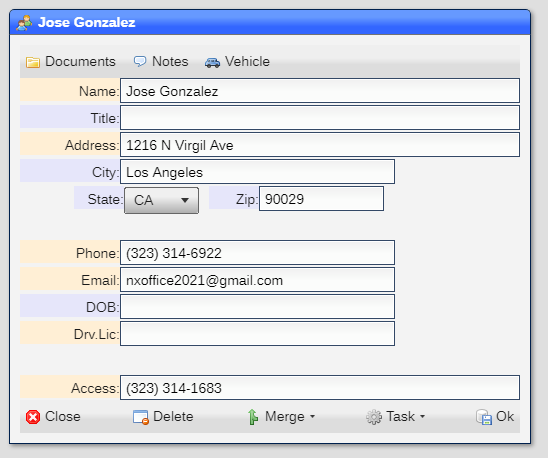
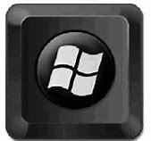

# AutoHotKeys

AutoHotKeys is a third party product that NX.Workspace uses to link your esisting system or systems to the NX.Workspace system.

You can download the product [here](https://www.autohotkey.com/).

You will also need a copy of the [NX.Workspace .ahk](https://github.com/nxproject/workspace/blob/master/readmes/nxworkspace.ahk) file, which you can use with the download.

## How it works

Once you have installed the two items above, you can tell the system which datasets and field within each dataset holds the value which
will be used as the matching key.  

1) Click on ***Start*** 
2) Select ***System***
3) Select ***Site Settings***
4) Select ***Services***
5) Select ***AutoHotKeys***
6) Enter a list of dataset/field pairs in the ***Dataset/Field*** field
7) Click on ***Ok*** to save

For example:

Tells the system thata the ***name*** field in the ***rolodex*** dataset is to be matched.

In order for the lookup to work, you must be logged in to your NX.Workspace site in a browser.

Now in your application, Move the cursor to the field that contains the name.  Here we will use Notepad as an example:

Now press the ***Windows Key*** and the letter ***s***, the switch to the browser:

You will see the matching record being opened.

If no matching record exists in any of the datasets used, the system will create a new entry in the first dataset listed.

## The Windows key

The Windows key looks like this:

[Home](../README.md)
