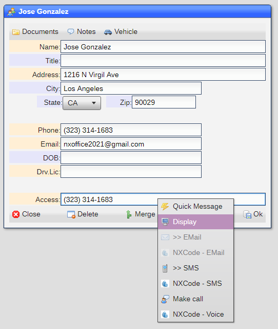
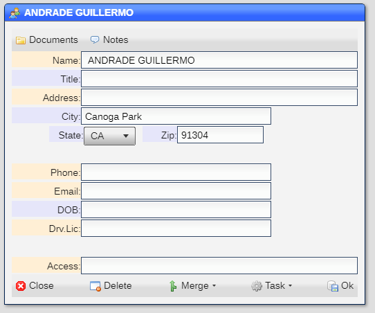
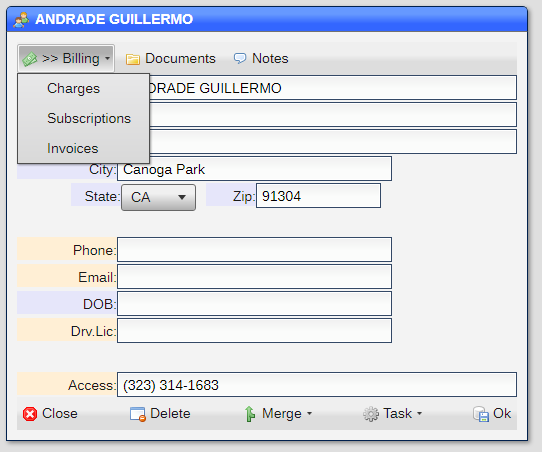

# Billing

The billing sub-system allows for:

* [Rate Table](README_B_RATE.md)
* [Charges](README_B_CHARGE.md)
* [Subscriptions](README_B_SUBS.md)
* [Invoices](README_B_INV.md)
* [Payment Request](README_B_PAY.md)

## Enabling billing

You enable billing ubsing the [Site Settings](README_SITE.md) tool.  In it you will find:


Setting the ***Billing*** entry to ***y*** enables the billing options.

You also need to include the ``BILLING``` selector for each [user](README_USERS.md) that is allowed access to the billing sub-system.

## Creating accounts

In order to create all the billing entries, you must have at least one [account](README_ACCOUNTS.md) field in one [dataset](README_D_DATASETS.md).

In my base system, I have a [rolodex](rolodex.pkg) dataset with a field labeled ***Access*** that fulfills this requirement.



## The simplest billing system

The simplest billing system is to take the [rolodex](rolodex.pkg) and enable [billing](README_D_DATASETS.md).  You now have a fully operational
billing system.  You should also enable [Twilio](README_SVCS.md) and/or [SendGrid](README_SVCS.md) if you wish to text and/or email invoices.

When you view an entry, it should look like this:



You can think of the [account](README_ACCOUNTS.md) field value as an ***account ID***, so if you enter a value and save the record, when you open it
next it should look like this:



You can now add charges, subscriptions and create invoices.  The simplest billing system.

[Home](../README.md)
