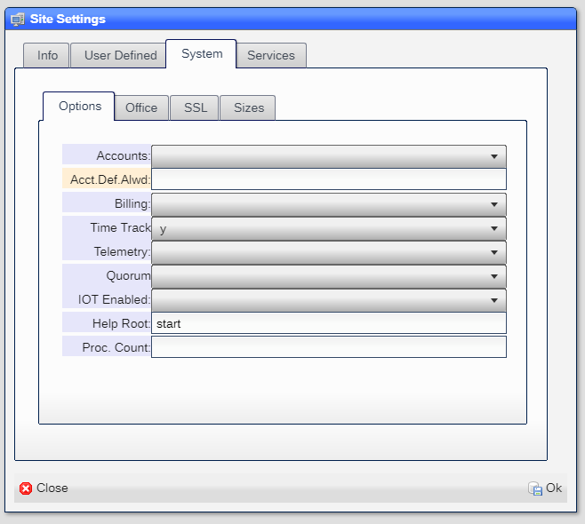

# Billing

The billing sub-system allows for:

* Rate table
* Charges
* Subscriptions
* Invoices
* Payment request

## Enabling billing

You enable billing ubsing the [Site Settings](README_SITE.md) tool.  In it you will find:



Setting the ***Billing*** entry to ***y*** enables the billing options.

You also need to include the ``BILLING``` selector for each [user](README_USERS.md) that is allowed access to the billing sub-system.

## Charges

TBD

## Invoices

TBD

## Payment request

TBD

[Home](../README.md)
