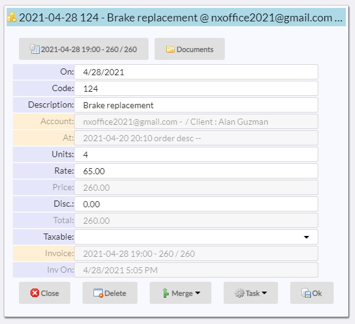
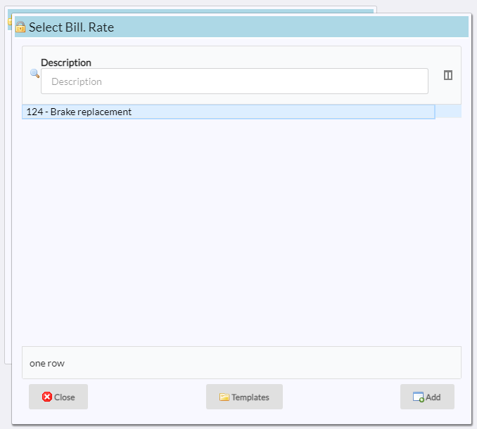
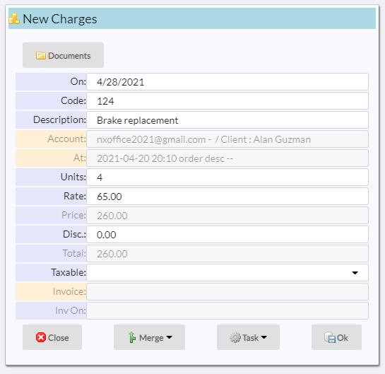

# Charges

Charges are generated at definable dataset levels.  The can be drawn from the [rate table](README_B_RATE.md).

## Entering a charge

This is what a new charge entry looks like:

|Field|Meaning|
|-|-|
|On|Date that the charge was made|
|Code|Item code|
|Description|Decription of item|
|Account|Account that the charge belong to (read-only)|
|At|Dataset entry where the charge was added (read-only)|
|Units|Number of units|
|Rate|Amount per unit to be charged|
|Price|Unts * rate (read-only)|
|Disc|Discount|
|Total|Price - discount|
|Inv|Invoice where the charged was included (read-only)|
|Inv On|Date that the charge was included in the invoice|

## Using the rate table

When you enter a piece of text seen in the [rate table secription](README_B_RATE.md) in the ***Code*** field and press ***tab*** or otherwise
leave the field, the system will display all the entries in the rate table:

Selecting an item from the rate table will fill in the charge:

You can now modify the charge.  Click on **Ok*** to save.

## Viewing open charges

If you click on the ***Open*** button at the bottom of the charges pick list, only the charges that have not been invoices are shown.

[Home](../README.md)
