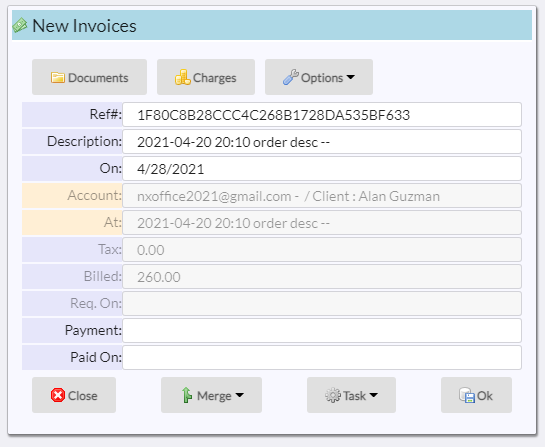

# Invoices

Invoices are created from all open charges.  

## Requesting payment

You can use the ***Request payment*** option to generate a payment request:

The handling depends on whether the account is a ***phone number*** or ***email address***.

### Phone account

An SMS text is sent out:

At the bottom, a clickable link takes the user to the same screen as an EMail.

### EMail account

An email is sent out, showing the invoice and a ***Pay*** button:

Clicking on the button takes the user to teh ***Stripe Checkout*** page:

Once payment is made, it will be recorded in the invoice.

[Home](../README.md)
