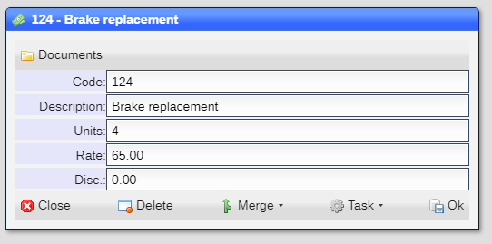

# Rate Table

The rate table allow you to define a set of charge templates that allow for accurate generation of charges.

|Field|Meaning|
|-|-|
|Code|User defined code|
|Description|Description|
|Units|Default number of units|
|Rate|Per unit amount to charge|
|Disc|Amount to discount by|

[Home](../README.md)
