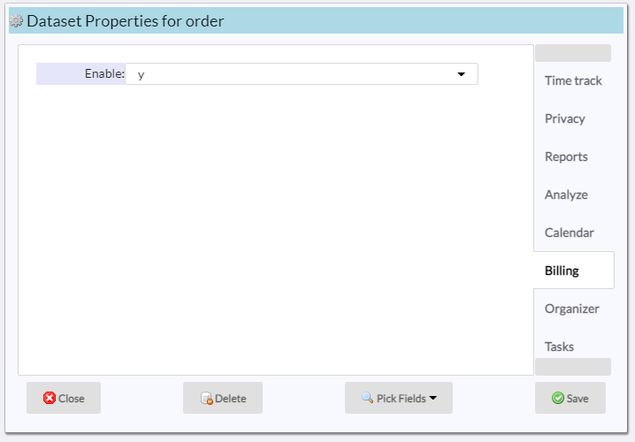

# Setting up billing

To setup billing, multiple screens need to be filled out.  We start with the ***Site settings***, ***System Billing*** page:

|Field|Meaning|
|-|-|
|Billing|Set to y to enable billing|
|Pay Req Tmplt|[EMail template](README_EMT.md) to be used.  If blank, the default template is used|
|Pay Req. Subj.|Text to use as subject in the pay request.  Default: Payment Request|
|Pay Req. Msg.|Text to use as the message in the pay request.  Default: Click on the button to complete the transaction|
|Inv. DOM|Day of the month to auto generate invoices.  Can be a negative number to compute from end of month.  If blank, no invoices are auto-generated|

## Pay button

The pay button is geneated when a [Stripe account](README_SVCS.md) is setup:

As shown, yu can use the ***test*** keys for testing but make sure that you are using the ***live*** keys to properly credit your account.

## Templates

The [EMail template](README_EMT.md) tool allows you to create invoice templates.  Two sections are explicitly used:

Note that all other sections are avaliable to fully customizze the invoice.

## Dataset

You need to decide which dataset can be used as a billing source.  This dataset must a descendant of the dataset that holds the [account](README_ACCOUNTS.md)
field.  In the examples, we set the ***order*** dataset to be the billable dataset:

In ur exaample, the structure is:

  * Client (holds the ***account*** field labeles as ***Access***)
  * Vehicle
  * Order (billing is done here)

In the simplest billing setup, the dataset that holds the account is the billable one.

[Home](../README.md)
