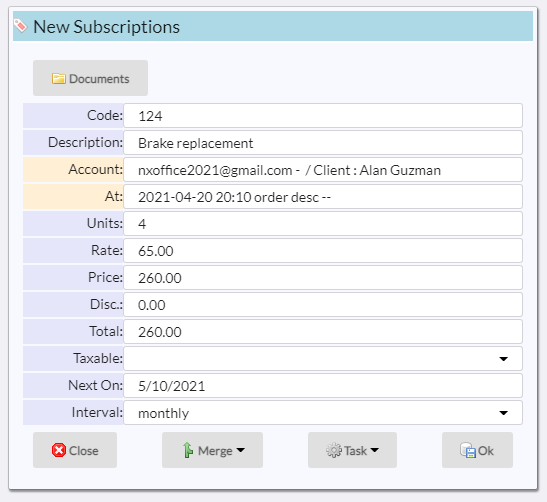

# Subscriptions

Subscriptions are charges that occur one or more times.  

As you can see, two new fields are added at the bottom:

|Field|Meaning|
|-|-|
|Next On|Date when the next charge will be created|
|Interval|Period of time to elpase between charges|

In the example, a new charge will be created on May 10th and repeated each month.

[Home](../README.md)
