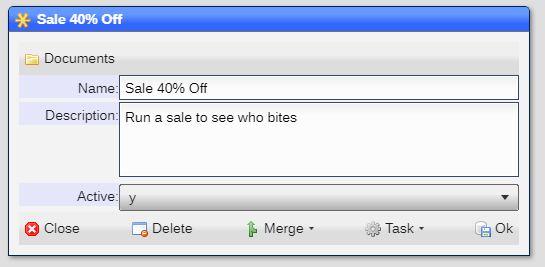

# Telemetry Campaign

A campaign allows for distinguishing telemetry data when analyzed:

|Field|Meaning|
|-|-|
|Name|Name of campaign|
|Description|Desciption of campaign|
|Active|Is the campaign displayable when generating a message|

[Home](../README.md)
