# Collaboration

NX.Workspace was built around the idea of collaboration, which in NX.Workspace means to be able to communicate
in realtime while working on a subject.

## Active collaboration

NX.Workspace keeps track of when multiple users and/or accounts are working with a ***dataset***, ***document***
or ***calendar*** and when a change if made by one user, the change is replicated to all users.  Changes are
detected as follows:

* ```Dataset``` - When the user modifies a field and then leaves it.
* ```Document``` - When a paragraph is modified and user moves to another paragraph.
* ```Calendar``` - When an event changes values.

Active collaboration is active at all times.

## Chat

While Quick Messages allowe for a quick back and forth, it becomes inconvenient when a number of interactions
is required or there is a subject matter to be dicussed.  For these situations, the Chat tool is available.

The Chat tool is invoked via the Chat button in the ***top toolbar*** in the window of the subject to be
discussed.  If the ***document*** and ***calendar**, the button is visble.  In a ***dataset*** the button is
part of the ***Options*** button:

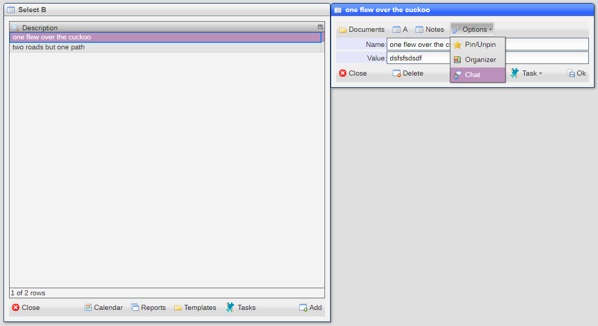

The chat button opens a chat window:

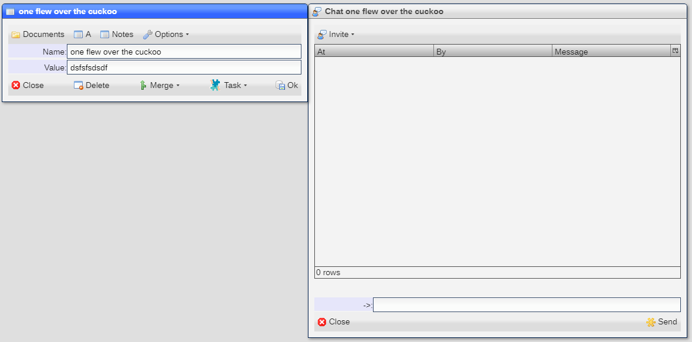

You can then invite another user to join you in the chat:

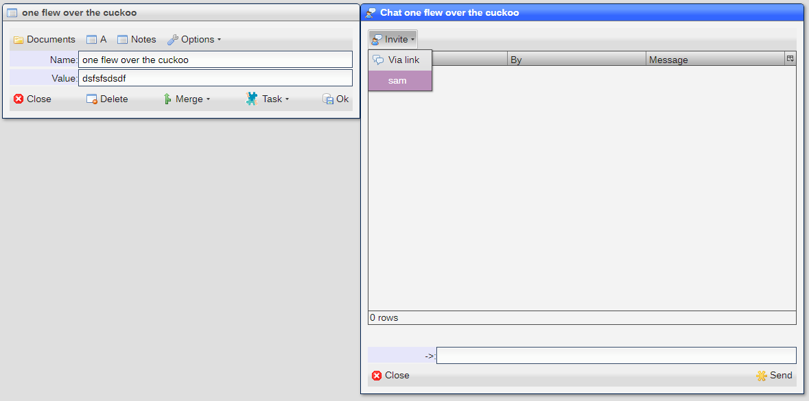

Which will display a ***modal*** invitation window:

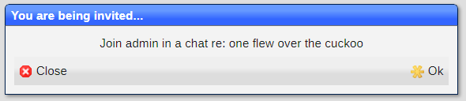

If the invitation is accepted, a response will be shown in the originating user chat window:

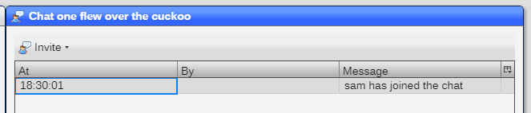

And a chat window will open for the recipient:

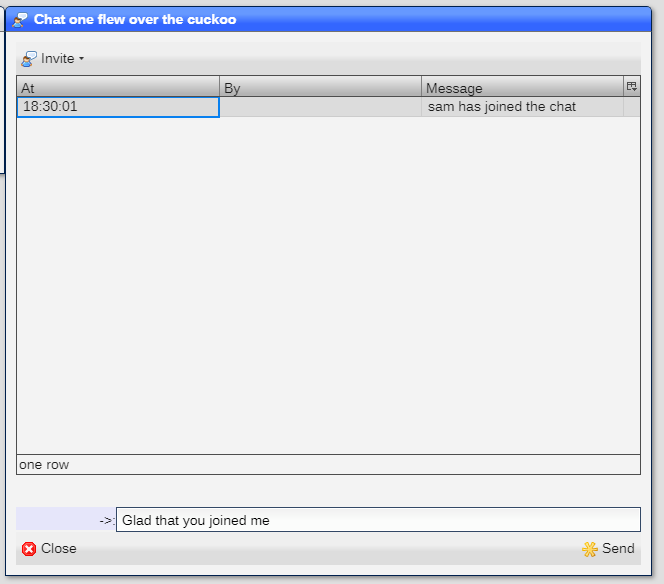

Now messages can flow back and forth:

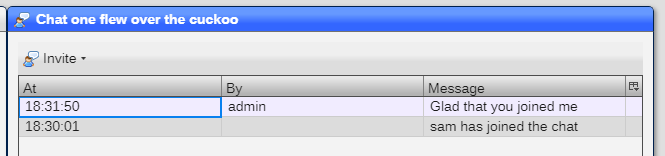


The recipient is also able to open the subject matter window:

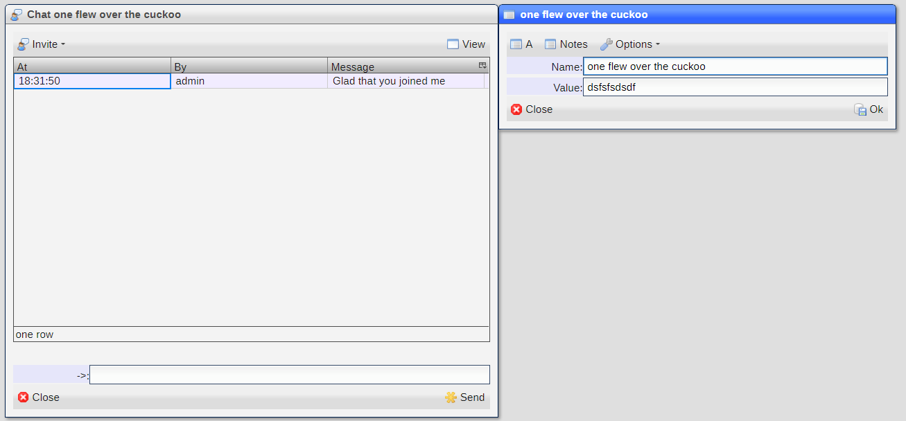

And then both chatting and ***active collaboration*** can take place.

Note that changes are saved when any user saves his/her subject matter window.

### Chatting with non-users

You can easily chat and collborate with people that are not users in your site. Use the ***Via link*** option
in the ***Invite*** button:

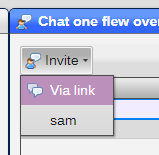

The system will ask for a name to be used as the identifier:

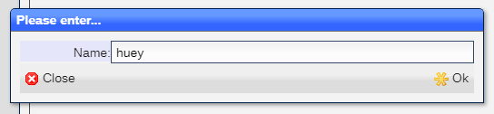

When completed, the system will create a ***chat account*** and display the ID number as a 
***notification***:

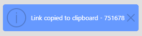

A copy the ***URL*** of the chat link into the ***clipboard***.   The use has the format of:

```
http://<siteurl>/?id=<chatid>
```

This ***account*** must be used within ***15 minutes*** of creation and can only bee used once.

Once the ***account*** uses the ***URL***, a chat session is opened:

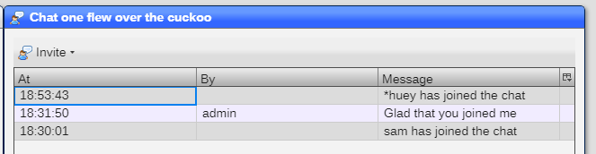

Now the ***account*** can access the subject matter just like any normal user.  The ***account** is
limited to the chat itself and has no entries in the ***Start*** menu.

[Home](../README.md)
