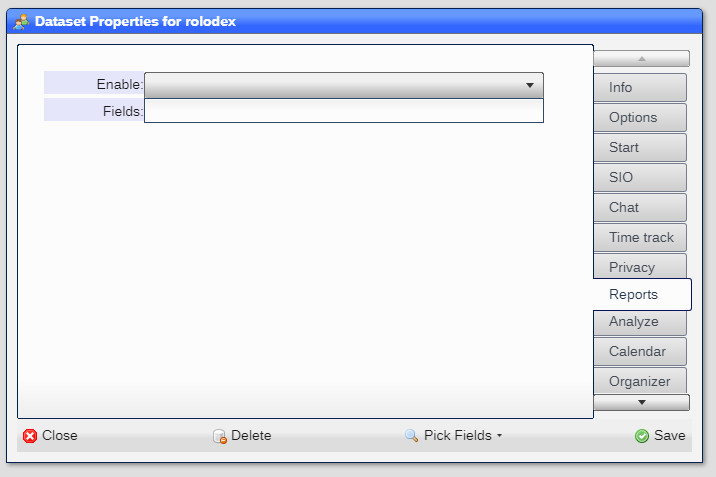
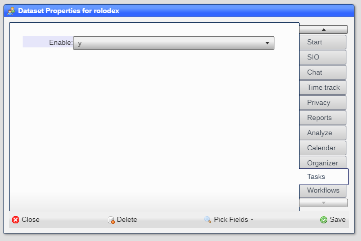

# Datasets

Datasets are defined using the ***Dataset/Views*** tool found in the ***System*** entry in the ***Start***
menu:


Click on any dataset entry to display the ***Dataset Properties*** window for the dataset:


|Field|Meaning|
|-|-|
|Caption|The displayable name of the dataset|
|Placeholder|***Expression*** definition of the description to be displayed in the ***pick*** list|
|Sort Order|The order in which placeholdes are to be displayed. asc for low to high, desc for high to low (default: asc)|
|Icon|Icon representation of the dataset|
|Default|Privileges to be used when none are given in the ***allowed*** entry for a ***user***|
|ID field|Field to be used as the internal object identifier|
|Child DSS|Datasets that the dataset serves as a parent|
|Linked DSS|Datasets that are related via a link|
|Task@Create|Task to run when an object is created|
|Task@Save|Task to run when an object is saved|

---


|Field|Meaning|
|-|-|
|Only one|If ***y*** only one child object is to be displaye at a time|
|Default Cmd|The ***command** to execute when the ***Enter*** key is pressed|
|Selector|The selector code if the dataset is to be limited use|

---


|Field|Meaning|
|-|-|
|Group|A group name that associates the dataset to other datasets in the ***Start*** menu|
|Priority|The relative position within the group|
|Index|The relative position within the priority. ***hidden*** if the dataset is not part of the ***Start*** menu|

---


|Field|Meaning|
|-|-|
|At save|A list of SIO commands to be sent when the object is saved|

---


|Field|Meaning|
|-|-|
|Enable|Is the chat feature available for the dataset|

---


|Field|Meaning|
|-|-|
|Enable|Is the time track feature available for the dataset|

Note that time tracking must be also enabled in the ***Site Settings***

---


|Field|Meaning|
|-|-|
|Enable|Is the privacy option to be shown|
|Private field|The field name that forces the object to be shown in the ***pick*** list.  Should be a ***group*** type field|

---



|Field|Meaning|
|-|-|
|Enable|Is the report option to be shown|
|Fields|The fields that can be shown in the report|

---


|Field|Meaning|
|-|-|
|Enable|Is the analyze option to be shown|
|Fields|The fields that can be shown in the analysis|
|Pick|The pick field to be used to get the data|

---


|Field|Meaning|
|-|-|
|Enable|Is the calendar option to be shown|
|Subject field|The field that describes the event in the calendar|
|Start On|The field that defines the start date and time in the calendar|
|End On|The field that defines the end date and time in the calendar|
|By fields|The fields that are used to filter by|

---


|Field|Meaning|
|-|-|
|Enable|Is the billing option to be shown|
---


|Field|Meaning|
|-|-|
|Enable|Is the organizer option to be shown|
|As root|**y/n** that determines whether the dataset has an ***organizer*** option|
|As child|***y/n*** that determnes whether the dataset is to be included in the organizer as a child dataset|

---



|Field|Meaning|
|-|-|
|Enable|Is the task option to be shown|

---


|Field|Meaning|
|-|-|
|Enable|Is the workflow option to be shown|
|Dataset|The dataset to be used to hold the workflow activities|
|Description|The description field|
|Assigned To|The assigned to field|
|Done by| The done by field|
|Started On|The field that holds the start date and time|
|Expected On|The field that holds the expected completion date and time|
|Ended On|The field that holds the end date and time|
|Outcome|The field that holds the activity outcome|
|Message|The field that holds the activity message|

---

## Adding datasets

You can add a dataset by right-mouse clicking on the ***Dataset/Views*** tool and selecting ***Add dataset(s)***:


You will be prompted to enter a list of dataset names to be added:


Each dataset will be created, along with a default view:


The dataset and view will have teo fields ***name*** and ***value***, which can be modified and/oor deleted.

## Deleting datasets

To delete a dataset, click on the ***Delete*** button in the ***command bar*** inn the ***Dataset Porperties***
tool for the dataset.

If you delete a ***system dataset***, the system will recrate the dataset and the views automatically.

## Dates in placeholders

In order to display dates as part of a placeholder, you need to use an ***expression*** to format the date or datetime 
field.  Fox example, this is the way that you can crate a placeholder with the datetime ***on*** field and the ***name***:

```
#datesortable([on],[*sys:timezone])#
```

If you only wish to display the date portion, you can use:

```
#dateonlysortable([on],[*sys:timezone])#
```

Thes functions plus the ***Sort Order*** dataset definition value provide a method to properly handle date fields in
a placeholder.  If the timezone parameter if onitted, the UTC datetime will be shown.

## System datasets

The system has a variety of datasets that hold system information.  These dataset names atrart with an undescrore ***_***.

You can modify all system datasets however you should not delete any fields that were previously defined as this may lead to unexpected behaviors.

Note that updates may modify the dataset definitions, which will undo any user changes.

[Home](../README.md)
