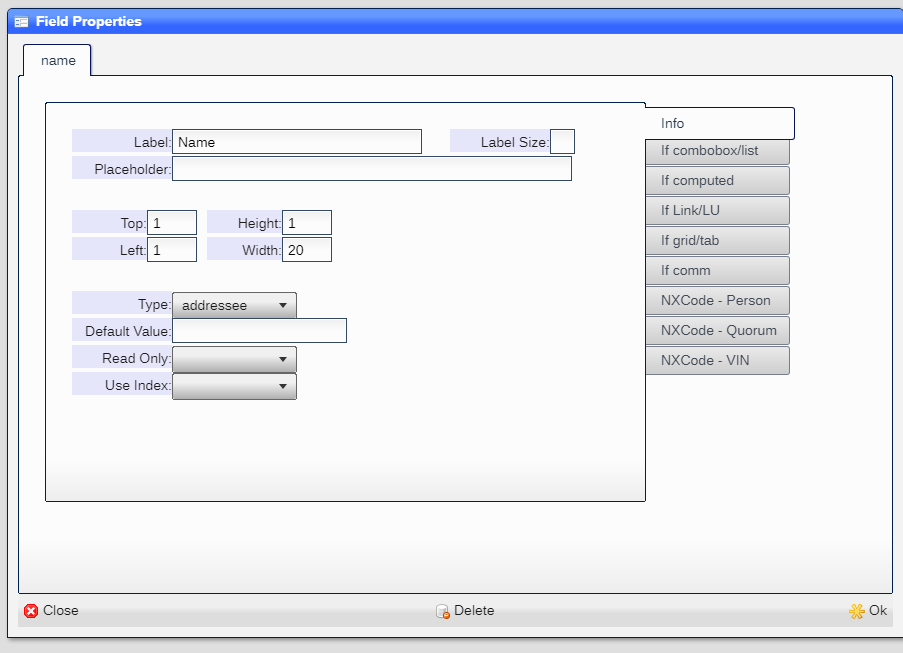
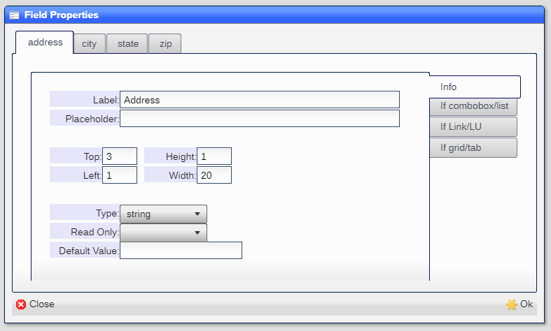

# Fields

## Field definition

The field definition window is accessed by right-mouse clicking on a field in the view:


This will display the field defition window for the field:



|Field|Meaning|
|-|-|
|Field|The field name. Shown as tab label|
|Label|The labe to be displayed next to the field|
|Label Size|The size of the label (default 4)|
|Placeholder|Text displayed when field is empty|
|Top|Row position|
|Height|Number of rows|
|Left|Column position|
|Width|Number of columns|
|Type|From list below|
|Read Only|Disables editing for the field|
|Default Value|The value assigned to the field at object creation. Can be an expression|

---


|Field|Meaning|
|-|-|
|Choices|The list of choices if the field is a combobox or list|

---


|Field|Meaning|
|-|-|
|Dataset|The dataset if the field is a link or lu|
|LU Map|The mapping of fields if the field is a lu|

---


|Field|Meaning|
|-|-|
|View(s)|The list of views if the field is a tab or a single view name if it is a grid|
|Align|When the field is a ***tab***, you can position the tabs in any of the sides (default: top)|

---


|Field|Meaning|
|-|-|
|Reference|The field that holds the name/type of the reference.  For example, a phone field may use a name field as the reference|

## Field types

### Simple fields

These are fields which hold a sinlge line of text:

* ```Address``` - Mailing address
* ```Allowed``` - Rules for a user or account
* ```AutoCaps``` - Capitalize each word
* ```Caps``` - Capitalize all text
* ```City``` - City
* ```CreditCard``` - Credit card number
* ```CreditCardExp``` - Credit card expiration date (mm/yy)
* ```Currency``` - Money amount
* ```Date``` - Date
* ```DateTime``` - Date and time
* ```Duration``` - Length of time
* ```EMail``` - EMail address
* ```Float``` - Floating point number
* ```Int``` - Integer number
* ```Keyword``` - Starts witha-z and only has a-z and 0-9
* ```Label``` - Display only
* ```Lower``` - force all text to lowercase
* ```Name``` - Person or entity name
* ```Password``` - Password (hidden and encoded)
* ```Protected``` - (hidden)
* ```Phone``` - Phone number.  If starts with +, an international number is assumed
* ```PnoneEMail``` - text can be either a phone number of EMail address
* ```SSN``` - U.S. Social Security number (xxx-xx-xxxx)
* ```String``` - A sting of text
* ```TextArea``` - Multiline text block
* ```Time``` - Time
* ```ZIP``` - USPS ZIP Code

### Choice fields

* ```Boolean``` - y or n
* ```ComboBox``` - Pick one from list
* ```Group``` - Pick one from the groups defined for the dataset
* ```ListBox``` - Pick any number from list
* ```State``` - U.S. State 2 character abbreviations
* ```Timezone``` - World wide time zones
* ```User``` - Pick one active user
* ```Users``` - Pick one user

### Complex fields

* ```Button``` - TBD
* ```Grid``` - A multiline table
* ```Image``` - Image
* ```Link``` - Link to another object.  Could be same dataset or different one
* ```LU``` - Table lookup from another dataset
* ```Signature``` - Signature capture
* ```Tabs``` - Displays multiple views as child tabs
* ```Upload``` - Uploads a file

## Adding fields

Any number of fields can be added by clicking on the ***Add fields*** button in the ***Dataset/View Editor***
tool.  You will be prompted for a list of field names to be added:


When the input is completed, the ***Field definition*** tool is shown with all of the ***new*** fields as
tabs, allowing for the completion of each field:



And when completed, the fields will be shown:


## Repositioning fields

The ***Dataset/View Editor*** allows you to resize the window and drag each field by the label to reposition
them on the screen.

## Deleting fields

ou can delete a field from the view by viewing the ***Field Definition*** and clicking on the ***Delete*** 
button.

## Dates

Date fields are designed to handle most date/time format and extract information from any given text:

* ```Today```
* ``` Tomorrow```
* ```Yesterday```
* ```Last Friday```
* ```17 August 2013```
* ```This Friday at 13:00```
* ```5 days ago```
* ```Sat Aug 17 2013 18:40:39 GMT+0900 (JST)```
* ```2014-11-30T08:15:30-05:30```

[Back* ``` to top](/help/README.md)