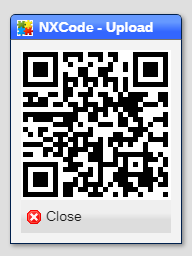
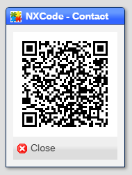
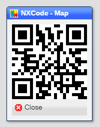
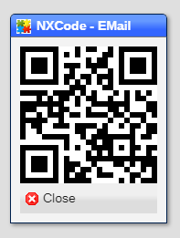
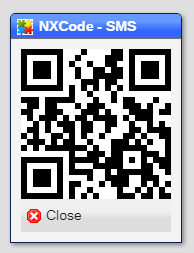
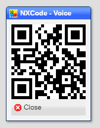

# NXCodes

NXCodes connect your smartdevice to NX.Workspace by creating a set of QR codes that are readable by a QR scanner app in your device.
NX.Workspace does not provide the app itself, which are available in whichever store your device uses.

## Document Upload

The NXCode - Upload tool allows you to use your smartdevice camera to capture and upload images:

## Contact

The NXCode - Contact tool allows you to download a name and address information block to your smartdevice:

Typically this creates a contact and is accessible from a **name** field.

## Map

The NXCode - Map tool allows you to download geocode information block to your smartdevice:

Typically this displays a map and is accessible from an **address** field.

## EMail

The NXCode - EMail tool allows you to download an email address to your smartdevice:

Typically this brings up an email client and is accessible from an **email** field.

## SMS

The NXCode - SMS tool allows you to download phone number to your smartdevice:

Typically this brings up an messaging client and is accessible from an **phone** field.

## Voice

The NXCode - SMS tool allows you to download phone number to your smartdevice:

Typically this brings up a phone dialer and is accessible from an **phone** field.

[Home](../README.md)
