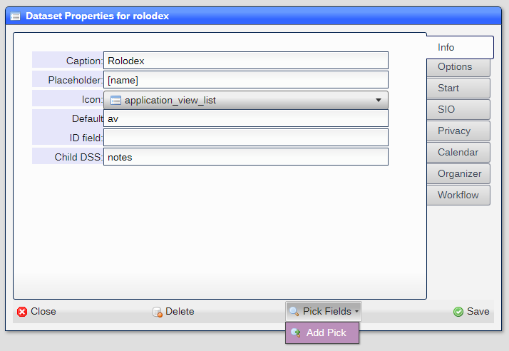
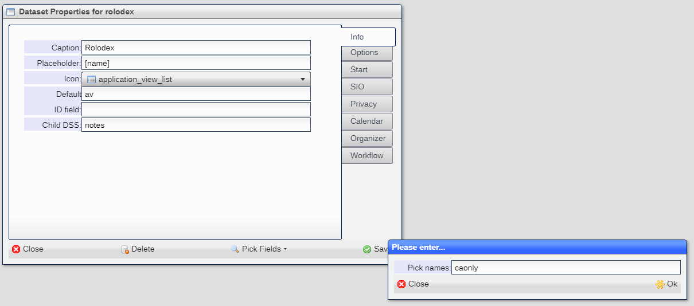
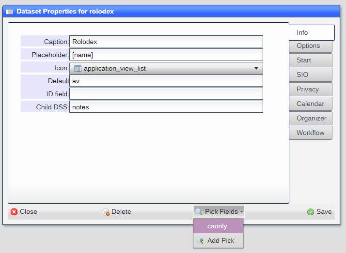
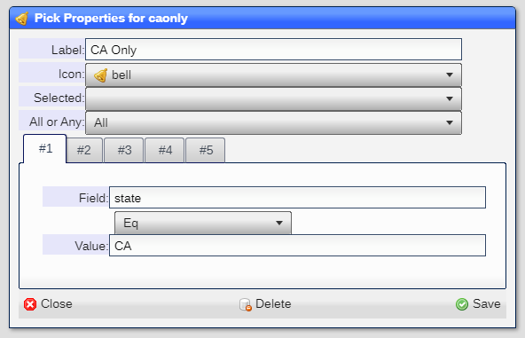
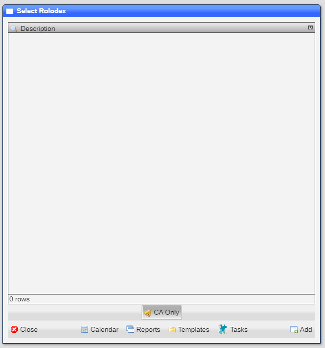

# Pick fields

Pick fields allow for the filtering of objects shown in a ***pick list*** by any field in the dataset.

## Adding a pick field

You can add a pick field by selecting ***Add Pick*** from the ***Pick Fields*** button the the ***Dataset Property***
window:

You will be prompted for a name, which is a keyword:

Once accepted the pick field is created and is available for editing.

## Editing a pick field

You can edit a pick field by selecting the pick field from the ***Pick Fields*** button the the ***Dataset Property***
window:

Once selecte dthe ***Pick Properties*** window is displayed:

|Field|Meaning|
|-|-|
|Label|The label to be used in the ***Pick List*** window|
|Icon|The icon to be displayed|
|All or Any|Do all of the conditions have to be met or just one|
|Query||
|Field|The field to use|
|Op|The operator|
|Value|The value.   Can by an evaluated expression, field or store index|

## Using a pick field

All of the pick fields defined for the dataset are displayed at the bottom of the ***Pick*** window:

Click on any to use th filter. Nte that the color of the pick field button changes when selected and that any number
of pick fields may be selected.  The objects displayed are onoly those where all the pick fields filters match the object.

## Deleting a pick field

You can delete a pick field by clicking on the ***Delete*** button in the ***command bar*** of the 
***Pick Properties*** window.

[Home](../README.md)
