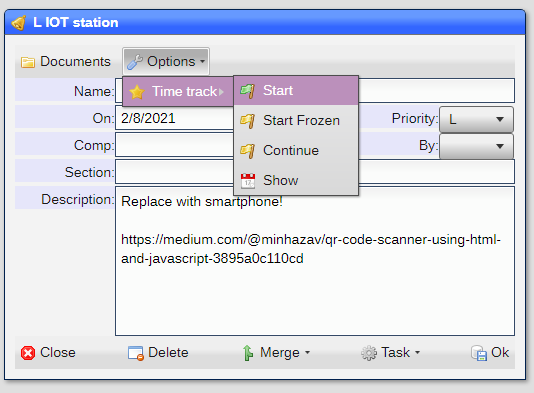
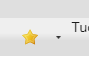
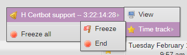

# Time Tracking

Time tracking is a simple to use way to keep track of open items and how much time has been spent on them.

## Adding a entry

You add an entry using the **Options** button on the object itself:

You have the follwoing options:

}Option|Use|
|-|-|
|Start|Start time tracking|
|Start Frozen|Start time tracking but hold off time accumilation|
|Continue|Continue a frozen item|
|Show|Display time tacked|

## Working with entries

Once the entry has been added, you access functionality via the **Pinned** button in the **taskbar**:

When clicked, you get a menu of all the tracked items:

Each tracked item displays the accumulated time in the format of : **days**:**hours**:**minutes**:**seconds**.

Each tracked item has a set of options:

|Option|Sub|Use|
|-|-|-|
|View||Display the item window|
|Time Track|||
||Freeze|Freeze the tracking|
||Continue|Continue the tracking|
||End|End the tracking|

[Home](../README.md)
