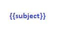

# EMail Templates

An EMail template is used to generate outbound emails.

|Field|Meaning|
|-|-|
|Code|Name of template|
|Description|Desciption of template|
|Text|HTML that makes the template|

You can enter the HTML for the template or ruse the ***EMail Template Editor*** by right clicking on the ***text*** field:

The editor works by allowing you to drag/drop blocks from the left section of the editor into the body or center section.
These are the block definitions:

|Image|Name|Use|
|-|-|-|
||Subject|Include the subject value|
||Message|Include the message value|
||Attachments|Include an attachments block|
||Actions|Include an actions block|
||Site Information|Include a site information block|
||Privacy|Include a privacy text block|
||Telemetry|Include a telemetry block|
||Image|Include an image block|
||Text|Include a text block|
||Title|Include a title text block|
||Columns|Include a two-column block|
||Share|Include a ***Follow Us*** block|
||Button|Include a clickable button|
||Gallery|Include an image gallery block|
||HTML|Include a raw HTML text block|

[Home](../README.md)
