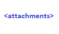

# EMail Templates

An EMail template is used to generate outbound emails.


|Field|Meaning|
|-|-|
|Code|Name of template|
|Description|Desciption of template|
|Text|HTML that makes the template|

You can enter the HTML for the template or ruse the ***EMail Template Editor*** by right clicking on the ***text*** field and selecting the ***Edit*** option:


The editor works by allowing you to drag/drop blocks from the left section of the editor into the body or center section.
These are the block definitions:

|Image|Name|Use|
|-|-|-|
||Subject|Include the subject value|
||Message|Include the message value|
||Attachments|Include an attachments block|
||Actions|Include an actions block|
||Site Information|Include a site information block|
||Privacy|Include a privacy text block|
||Telemetry|Include a telemetry block|
||Image|Include an image block|
||Text|Include a text block|
||Title|Include a title text block|
||Columns|Include a two-column block|
||Share|Include a ***Follow Us*** block|
||Button|Include a clickable button|
||Gallery|Include an image gallery block|
||HTML|Include a raw HTML text block|

## Merge fields

You can also insert merge field codes into any text by using the ***Merge Fields*** option in the edit menu:


These generate the [directives](README_LE.md) for each type of entry:

|Entry|Directive|
|-|-|
|Subject|\{\_subject}}|
|Message|{{\_message}}|
|Data|{{replace_with_field}}|
|Attachments|```{{#if \_attachments}}<b>Attachments</b>{{#each \_attachments}}<br /><a class="aee-image-block-button" href="{{this.href}}" target="_blank" style="display: inline-block; color: #ffffff; background-color: {{this.color}}; border: solid 1px {{this.color}}; border-radius: 5px; box-sizing: border-box; cursor: pointer; text-decoration: none; font-size: 14px; font-weight: bold; margin: 2; padding: 12px 25px; text-transform: capitalize;">{{this.caption}}</a>{{/each}}{{/if}}<br />```|
|Actions|{{#if \_actions}}<br />{{#each \_actions}}<br /><a class="aee-image-block-button" href="{{this.href}}" target="_blank" style="display: inline-block; color: #ffffff; background-color: {{this.color}}; border: solid 1px {{this.color}}; border-radius: 5px; box-sizing: border-box; cursor: pointer; text-decoration: none; font-size: 14px; font-weight: bold; margin: 2; padding: 12px 25px; text-transform: capitalize; border-color: {{this.color}};">{{this.caption}}</a>{{/each}}{{/if}}<br />|
|Site Information|<span style="font-size: 12pt; "><b>{{\_sys.name}}</b></span><br>{{\_sys.addr1}}<br>{{\_sys.city}}, {{\_sys.state}}&nbsp;<br>{{\_sys.phone}}<br></span>|
|Payment Request|{{\_paymentrequest}}|

Note that you can use any field that is part of the [extended merge](EADME_T_MERGE.md) logic available for documents.


[Home](../README.md)
