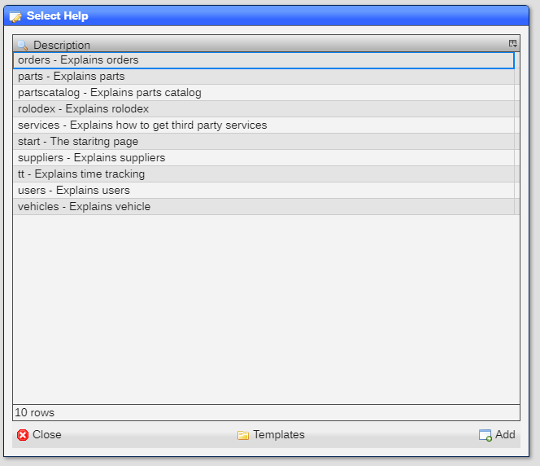
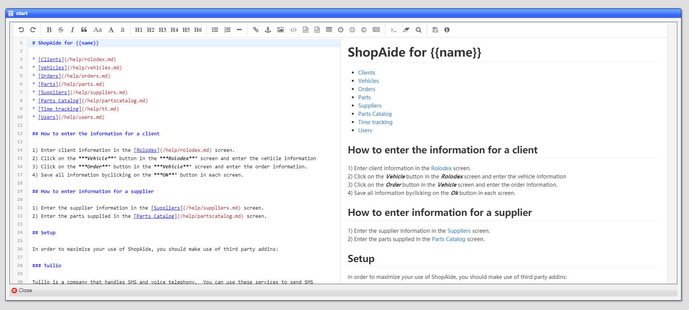
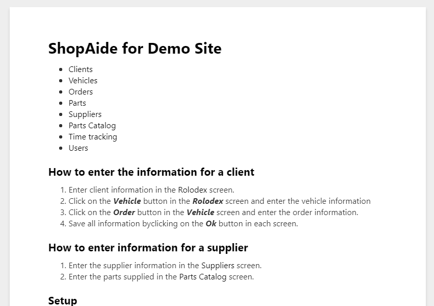

# Help

The help dataset allows you to create a help system.   The text itself is written in [Markdown](https://www.markdownguide.org/).

## What a help dataset typically looks like

This is the pick list for a help system with multiple pages:



## What a help page looks like

And this is a typical help page:


## Editor

When you right mouse click on the help page text, the context menu allows for you to see the text in an editor:



This is a WYSIWYG editor that shows both the source and final version of the text.

## Linking the help

You link in your help, which overrides the default help kept at [GitHub]() by setting the ***Help Root*** entry
in the ***Site Settings***:


## What the finished help looks like

Once linked, clicking on the ***HElp*** entry in the ***Start*** menu, displays the root page:



## Enabling help for the user

In order to have the user access help, you need to setup the ```HELP``` selector in the [***Allowed***](README_USERS.md) setting.  


[Home](../README.md)
