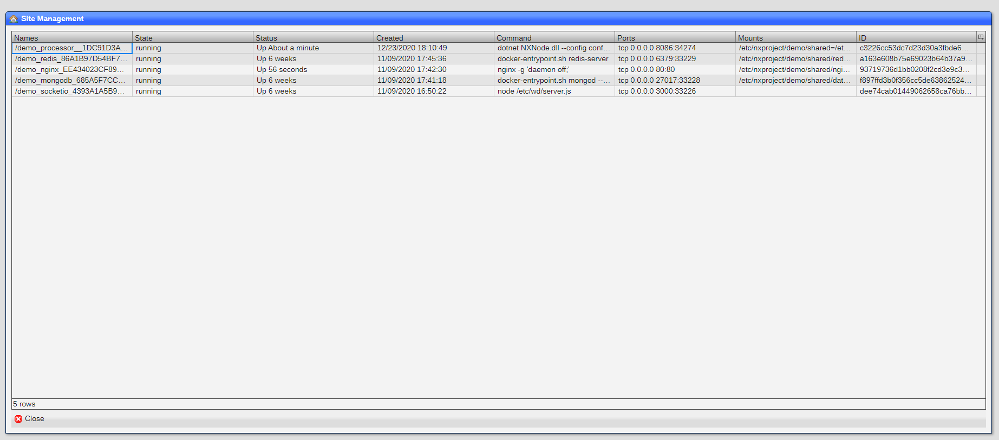

# Infrastructure

NX.Workspace is designed to run in any cloud environment using containers to hold each sub-system.

You can see the of each container by using the ``Site Manager`` tool located in the ``System`` Start menu entry.



## Containers

### Processor

The processor containers handle all the calls from the browsers.  They also run all chores.

### PerconaNoSql

The perconanosql container holds the database.

### SocketIO

The socketio container handles all realtime communications among browser and processors.

### Nginx

The nginx container handles routing of calls between browsers and processors.

## Docker

When running the state of the images aand cotainer should look like these.

### Images

```
root@site:~# docker images ls

REPOSITORY                              TAG                 IMAGE ID            CREATED             SIZE
nxproject/processor                     dev                 3ac39fb36fc7        About a minute ago   497MB
nxproject/libreoffice                   dev                 61d976878a5c        3 hours ago          1.72GB
nxproject/socketio                      dev                 1718e6f0d3d1        13 hours ago         126MB
nxproject/dotnet                        dev                 ac840b7d8c3d        39 hours ago         340MB
nxproject/perconanosql                  dev                 337025c95bb2        4 days ago           507MB
nxproject/nginx                         dev                 54b0f01cc316        4 days ago           133MB
nxproject/redis                         dev                 5482192953b5        4 days ago           78.5MB
nxproject/base                          dev                 9343dd886fbb        4 days ago           72.9MB
mhart/alpine-node                       10                  7d3849b7af27        2 weeks ago          73.7MB
mcr.microsoft.com/dotnet/core/runtime   3.1                 aeda02cc2c98        4 weeks ago          190MB
```

### Containers

```
root@site:~# docker ps -a

CONTAINER ID        IMAGE                        COMMAND                  CREATED             STATUS              PORTS 
768a77a7462a        nxproject/libreoffice:dev    "dotnet NXLibreOffic…"   30 seconds ago      Up 26 seconds       0.0.0.0:33846->8088/tcp                    site_libreoffice_65D7804691954FC2AD37912B1B74F3A9
6bcc46e8b04a        nxproject/nginx:dev          "tini -- nginx -g 'd…"   35 seconds ago      Up 29 seconds       0.0.0.0:80->80/tcp, 0.0.0.0:443->443/tcp   site_nginx_EE434023CF89D7DFB21F63D64FF9D74
83508fa001dd        nxproject/processor:dev      "dotnet NXNode.dll -…"   59 seconds ago      Up 56 seconds       0.0.0.0:33845->8086/tcp                    site_processor__B32411F4E1174D00B992891ED633B108
0e0f134a55c7        nxproject/socketio:dev       "node /etc/wd/server…"   13 hours ago        Up 13 hours         0.0.0.0:33841->3000/tcp                    site_socketio_4393A1A5B976BFDD99B321D2187FBE3E
b314938aaf28        nxproject/perconanosql:dev   "tini -- bash /entry…"   3 days ago          Up 3 days           0.0.0.0:33707->27017/tcp                   site_perconanosql_94673753C91BECCCA94270AAF5F7239FNAMES
```

## NX.Project

NX.Workspace uses ``NX.Node``.  Documentation for this aspect of the system can be found [here](https://github.com/nxproject/node).


[Home](../README.md)
