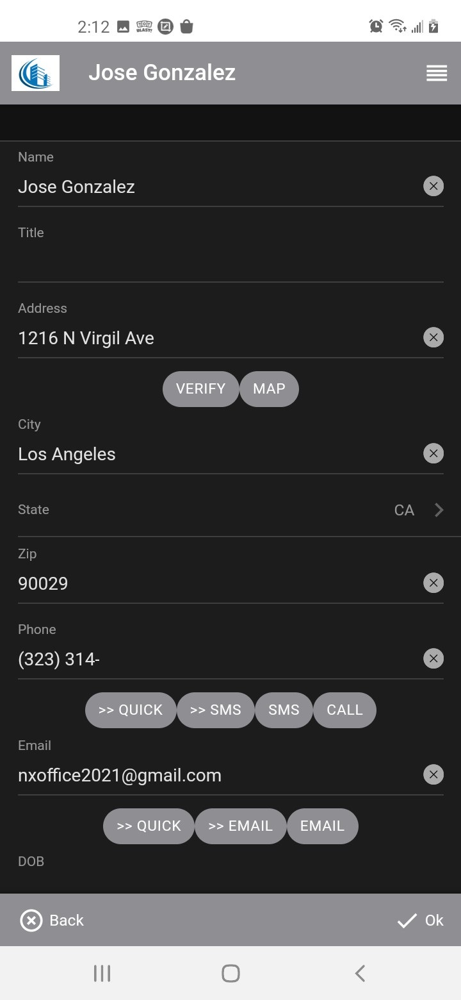

# Mobile Support

You can access your site from a phone or tablet device by adding ***/mobile*** to your url.  For example if you
normally acces your site using:

```
https://mysite.com
```

You can access the site from your phone by using:

```
https://mysite.com/mobile
```

Almost all the functionality is available in your mobile device with the exception of functionality that requires a large screen like editors.

## Login screen


The login screen is similar to the login scrren in the ***webtop*** version,

## Select


The select screen is the equivalent of the ***Start*** button in the ***webtop*** version.

## Pick list


The pick list is similar to the ***webtop*** version except that it displays 25 rows at a time.  You can use the search box at the top to
filter for a value.

## Data



The data screen is equivalent to a data input window in the ***webtop*** version except that fields are stacked vertically and tabs
are expanded.

## Navigation


Clicking on the ***top left*** icon displays the equivalent of the ***Start*** menu at any time that is useful to do so.
You can switch to new dataset pick list which does not cancel your current work, just puts it on hold, like stacking windows
in the ***webtop*** version.

Uou can navigate to any open window by using the extended menu at the bottom of the navigation menu, just remember that moving back
closes and saves any changes to the windows above the one that you navigate to.

## Toolbar


Similarly to the navigation menu, clickking on the ***top right*** ```menu``` icon displays wha would be the ***bottom toolbar***
for pick lists and the ***top toolbar*** for data screens.

## Adding link to device Home Page

In Android devices, you can make the mobile link behave like an app.  Simply open the browser and navigate to your mobile URL
and then select ***Add to Home Page*** in the browser settings:


[Home](../README.md)
