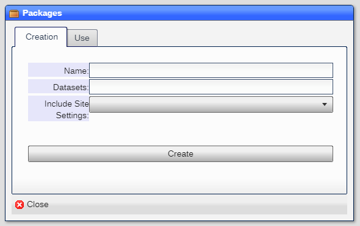
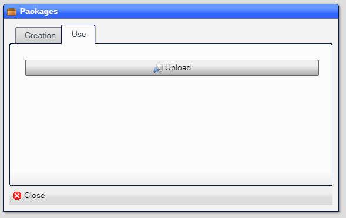

# Packages

Packages is a tool that allows for the import and export of information:

## Exporting

|Field|Meaning|
|-|-|
|Name|The name of the package|
|Datasets|The list of datasets to include in the package.  If a dataset is prefixed with a plus sign ***+***, the data and documents are included in the package|
|Include Site Settings|Includes the following sits settings:|
||Time track|
||Hep root|
||Accounts|
||Account default allowed|
||Billing|
||Quorums|
||Telemetry|
|Create|Creates the package|

## Importing

|Field|Meaning|
|-|-|
|Upload|Uploads a package into the system|

Note that it takes the system a short amount of time to integrate the items in the package into the system.  
You will see multiple notifications as the integration progresses.

[Home](../README.md)
