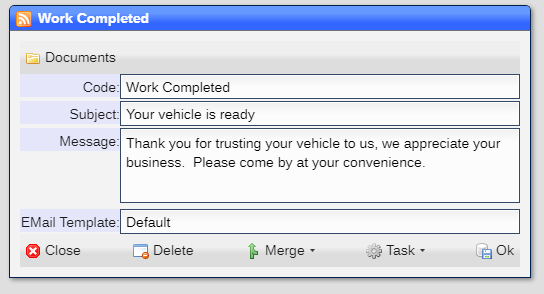
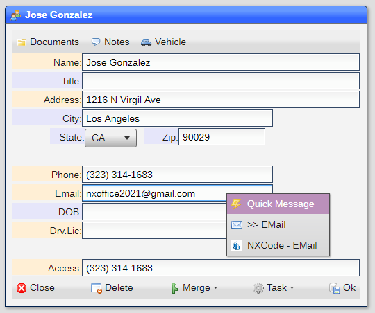

# Quick Messages

A quick message is a pre-defined message:

|Field|Meaning|
|-|-|
|Code|Name of quick message|
|Subject|Subjct text|
|Message|Message text|
|EMail Template|Name of template to use|

## Enabling quick messages

In order for a user to be able to use quick messages, the ***allowed*** firld for the user must contain ***?QUICK***.

## Using a quick message

Quick messages are accessed in any ***account***, ***email*** or ***phone*** fields as part of the field options, displayed by a right mouse click:

A list of quick messages is shown and when any are selected, it will be sent.

[Home](../README.md)
