# Site

Each site has a set of information of global nature.  They are the ***Site Settings*** and ***Site Management***.
They are found in the ***System*** entry of the ***Start*** menu.

## Site Settings

The Site Settings allow you to set the information that is global to the site:

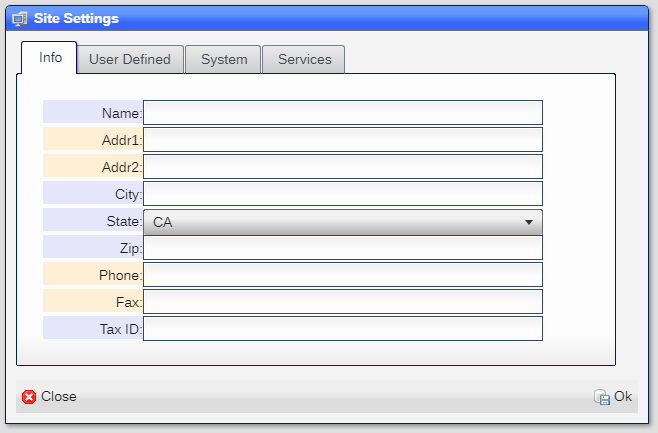

|Field|Meaning|
|-|-|
|Name|The name of the site|
|Addr1|The street address|
|Addr2|Extra address|
|City|City|
|State|State|
|Zip|SIP code|
|Phone|Main phone number|
|Fax|Main Fax number|
|Tax ID|EIN|

---

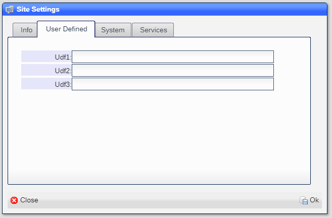

|Field|Meaning|
|-|-|
|Udf1|User defined|
|Udf2|User defined|
|Udf3|User defined|

---

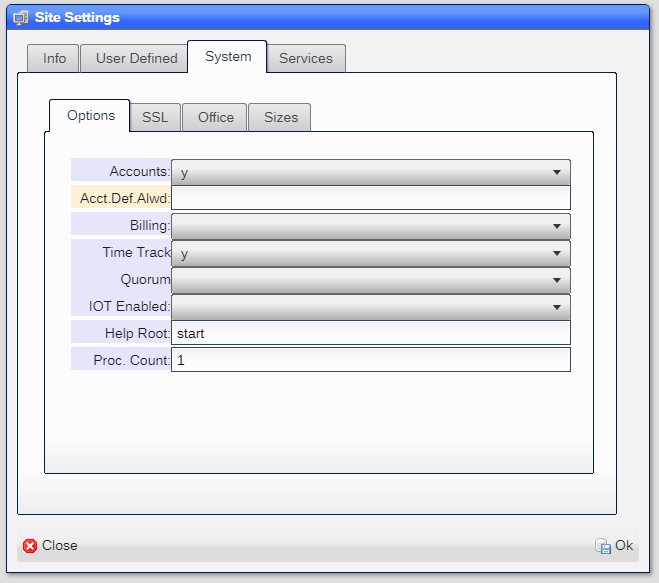

|Field|Meaning|
|-|-|
|Accounts|Are account available|
|Acct.Def.Alwd|The default allowed for accounts|
|Billing Enabled|Is billing available|
|Time Track|Is the time track option available|
|Quorum|Is the quorum option available|
|IOT Enabled|Is the IOT option available|
|Help root|The starting page for user defined help|
|Proc. Count|Number of processor instances allowed|
---

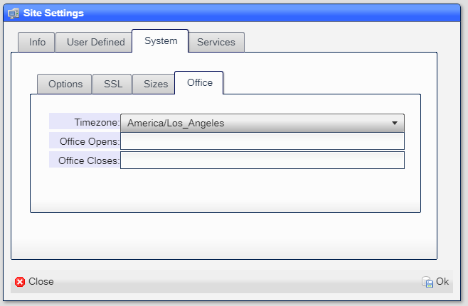

|Field|Meaning|
|-|-|
|Timezone|Site-wide time zone|
|Office Opens|The hour of the day when the office opens|
|Offic Closes|The hour of the day when the office closes|

---

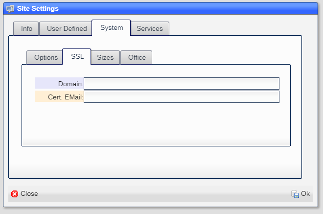

|Field|Meaning|
|-|-|
|Domain|The domain to use in the SSL certificate|
|Cert. EMail|The email address to use in the SSL certificate|

Note that it may take a few minutes to obtain a new SSL certificate from ***Let's Encrypt***.

---

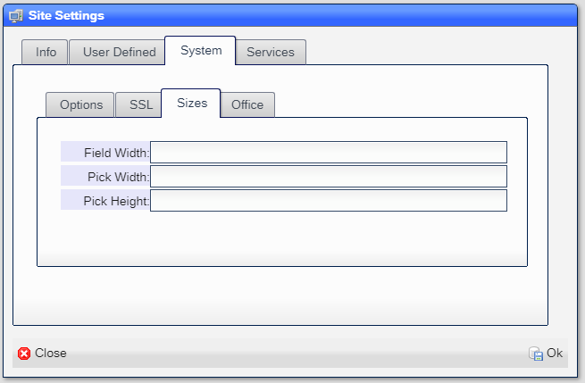

|Field|Meaning|
|-|-|
|Field Width|The default field width used at time of creation (default 20)|
|Pick Width|The width os a pick field (default 20)|
|Pick Height|The height of the pick field (default dependent on screen size)|

---

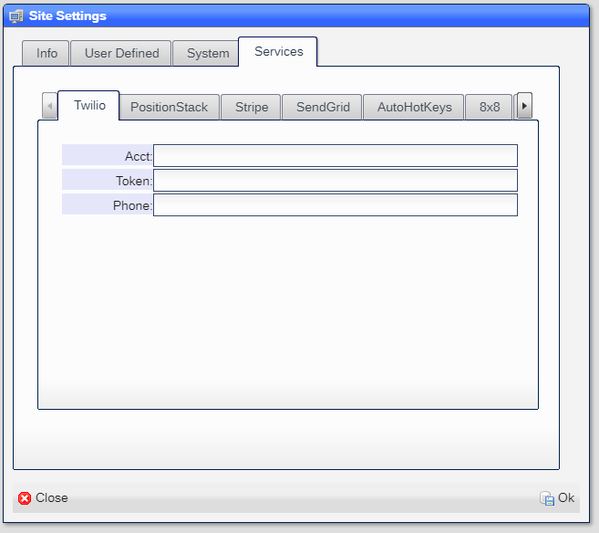

|Field|Meaning|
|-|-|
|Acct|The Twilio account ID|
|Token|The Twilio account token|
|Phone|Site-wide Twilio phone|

---

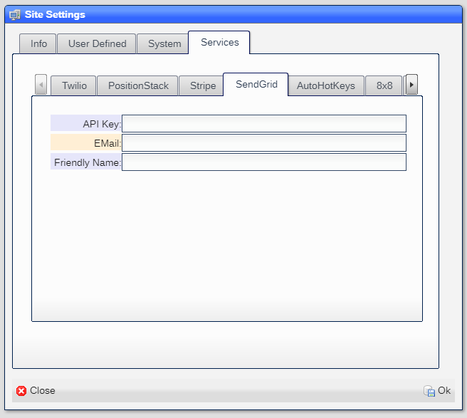

|Field|Meaning|
|-|-|
|API Key|YThe API key for the PositionStack service|
|EMail|The email address to use|
|Friendly name|The displayed name|

---

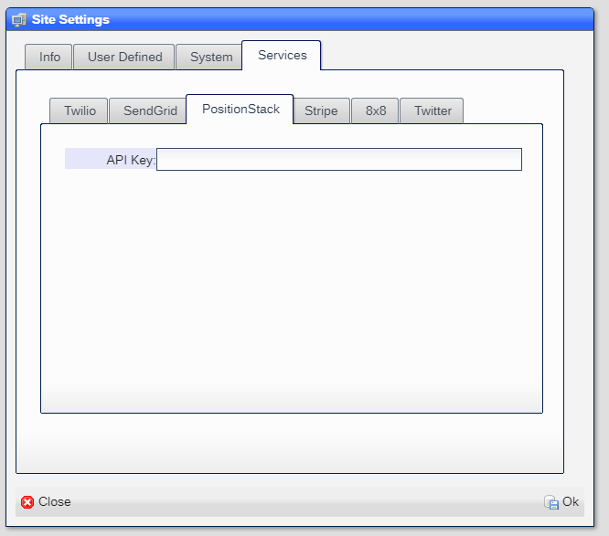

|Field|Meaning|
|-|-|
|API Key|The API key for the PositionStack service|

---

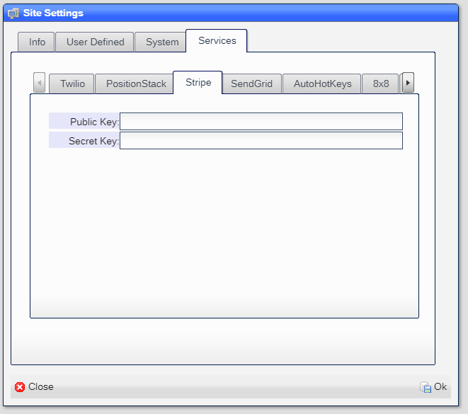

|Field|Meaning|
|-|-|
|Pubic Key|The public key for the Stripe service|
|Secret Key|The secret key for the Stripe service|

---

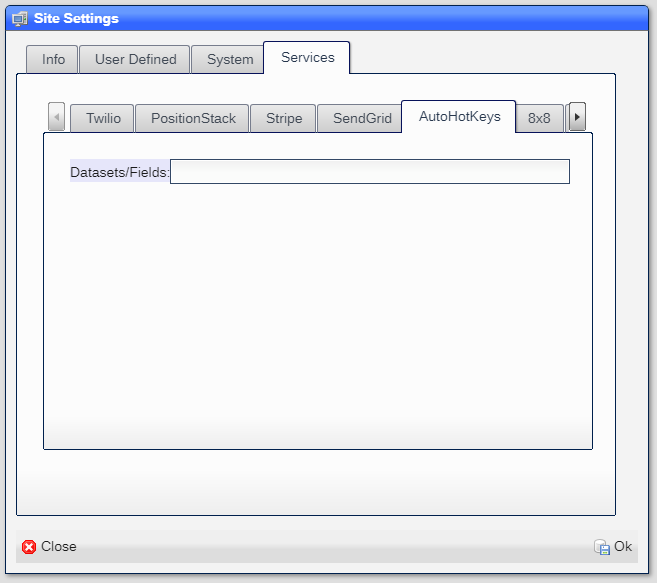

|Field|Meaning|
|-|-|
|Datasets/Fields|List of datasets and key fieds to be searched by AutoHotKeys|

You can get the ***AutoHotKeys*** program [here](https://www.autohotkey.com/).
You can get the ***NX.Workspace*** script file [here](https://github.com/nxproject/workspace/blob/master/readmes/nxproject.ahk).

---

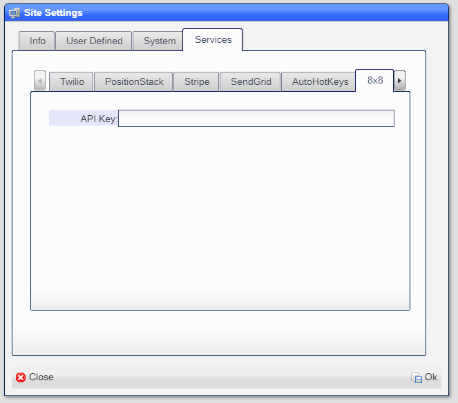

|Field|Meaning|
|-|-|
|API Key|The API key for the 8x8 Jitse service|

---

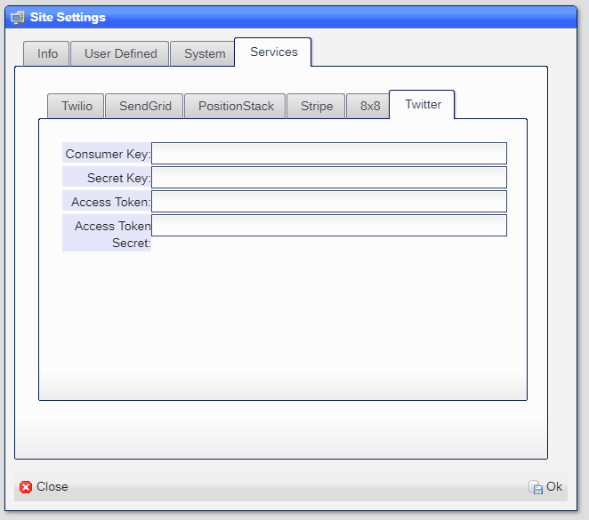

|Field|Meaning|
|-|-|
|Consumer Key|Provided by Twitter|
|Secret Key|Provided by Twitter|
|Access Token|Provided by Twitter|
|Access Token Secret|Provided by Twitter|

## Site Management

The Site Management tool displays the running containers of the site:

---

|Column|Meaning|
|-|-|
|Names|The name of the container|
|State|The state of the container.  Should be ***running***|
|Status|The length of time since  container creation|
|Created|The date and time when the container was created|
|Command|The command line when the container was created|
|Ports|The list of TCP/IP ports that the container is using|
|Mounts|The devices that the container is using|
|ID|The Docker ID for the container

---

Clicking on any container shows the log for the container:

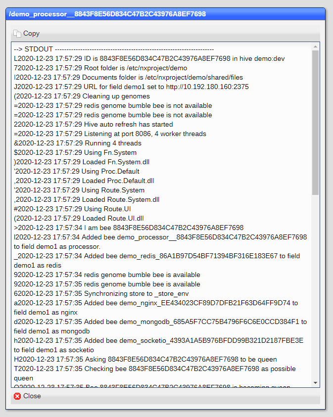

The log can be copied to the clipbord and then pasted elsewhere for debugging purposes.

[Home](../README.md)
