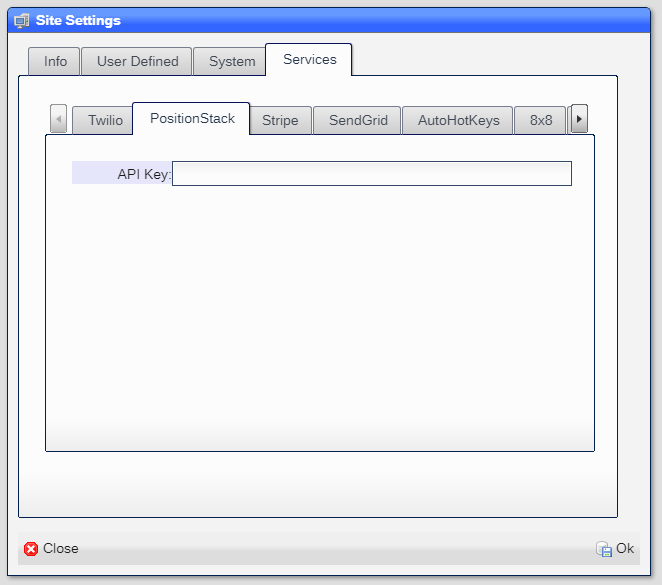
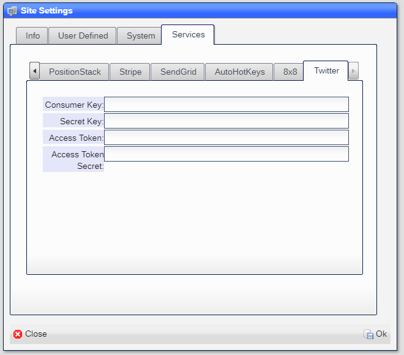

# Site

Each site has a set of information of global nature.  They are the ***Site Settings*** and ***Site Management***.
They are found in the ***System*** entry of the ***Start*** menu.

## Site Settings

The Site Settings allow you to set the information that is global to the site:

|Field|Meaning|
|-|-|
|Name|The name of the site|
|Addr1|The street address|
|Addr2|Extra address|
|City|City|
|State|State|
|Zip|SIP code|
|Phone|Main phone number|
|Fax|Main Fax number|
|Tax ID|EIN|

---

|Field|Meaning|
|-|-|
|Udf1|User defined|
|Udf2|User defined|
|Udf3|User defined|

---

|Field|Meaning|
|-|-|
|Proc. Count|Number of processor instances allowed|
|Time Track|Is the time track option available|
|IOT Enabled|Is the IOT option enabled|

---

|Field|Meaning|
|-|-|
|Domain|The domain to use in the SSL certificate|
|Cert. EMail|The email address to use in the SSL certificate|

---

|Field|Meaning|
|-|-|
|Field Width|The default field width used at time of creation (default 20)|
|Pick Width|The width os a pick field (default 20)|
|Pick Height|The height of the pick field (default dependent on screen size)|

---

|Field|Meaning|
|-|-|
|Timezone|Site-wide time zone|
|Office Opens|The hour of the day when the office opens|
|Offic Closes|The hour of the day when the office closes|

---

|Field|Meaning|
|-|-|
|Twilio Acct|The Twilio account ID|
|Twilio Token|The Twilio account token|
|Twilio Phone|Site-wide Twilio phone|

---

|Field|Meaning|
|-|-|
|API Key|YThe API key for the PositionStack service|

---

|Field|Meaning|
|-|-|
|Pubic Key|The public key for the Stripe service|
|Secret Key|The secret key for the Stripe service|

---

|Field|Meaning|
|-|-|
|API Key|YThe API key for the 8x8 Jitse service|

---

|Field|Meaning|
|-|-|
|Consumer Key|Provided by Twitter|
|Secret Key|Provided by Twitter|
|Access Token|Provided by Twitter|
|Access Token Secret|Provided by Twitter|

## Site Management

The Site Management tool displays the running containers of the site:

---

|Column|Meaning|
|-|-|
|Names|The name of the container|
|State|The state of the container.  Should be ***running***|
|Status|The length of time since  container creation|
|Created|The date and time when the container was created|
|Command|The command line when the container was created|
|Ports|The list of TCP/IP ports that the container is using|
|Mounts|The devices that the container is using|
|ID|The Docker ID for the container

---

Clicking on any container shows the log for the container:

The log can be copied to the clipbord and then pasted elsewhere for debugging purposes.

[Home](../README.md)
