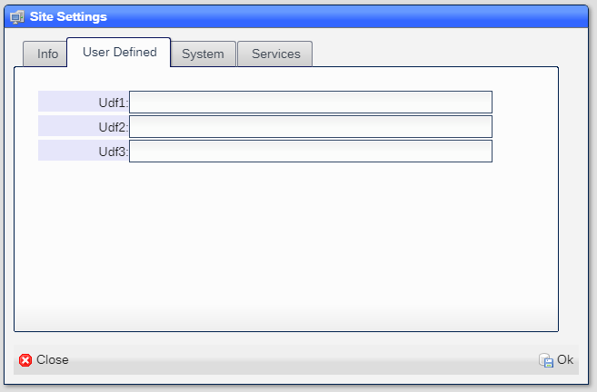

# Services

These are the third party services that NX.Workspace uses.  Use of these services are optional and controlled via
the **Site Settings** tool.

## Twilio

Twilio is used to send and receive SMS and MMS messages and to make and receive phone calls.  To get the information
required visit:

```
https://www.twilio.com/
```

### Setup

 You create a Twilio account by clicking [here](https://www.twilio.com/try-twilio),

Once you have done that, you will get ***Account SID, token and phone number*** [here](https://www.comm100.com/livechat/knowledgebase/where-do-i-find-the-twilio-account-sid-auth-token-and-phone-number-sid.html#:~:text=Here%20is%20how%20to%20access%20this%20information%3A%201,can%20find%20the%20SID%20for%20the%20phone%20number.).

You enter the information in your ***Site Settings*** as shown here:



You access this by clicking on the ***Start*** button and selectib ***System*** and then ***Site Settings***.

This will link your site with the Twilio services.

Next is to tell ShopAide which users can make use of the services.  The best way is to create a single ***Allowed extensions*** entry that holds all the default entries.  You do this by clicking on the ***Start*** button and selectib ***System*** and then ***Allowed Extensions***.

Next click on the ***Add*** button and enter the following:


The key value is ```?TELE``` which tells the system that the user can use the telephony options, which include Twilio.  The rest of the field should contain the values appropriate for your site.

## PositionStack

PositionStack is used to validate addresses and to geocode.  To get the information reqired visit:

```
https://positionstack.com/
```

## SendGrid

SendGrid is used to send emails.  To get the information reqired visit:

```
https://sendgrid.com/
```

## Stripe

Stripe is used to accept online payments.  To get the information reqired visit:

```
https://stripe.com/
```

## 8x8

8x8 Jitsi is used to create video conferences.  To get the information reqired visit:

```
https://jaas.8x8.vc/
```

## Twitter

Twitter is used to send twits and to geocode.  To get the information reqired visit:

```
https://developer.twitter.com/en
```


[Home](../README.md)
