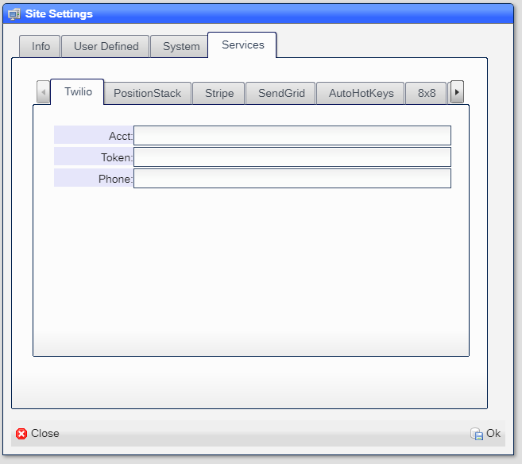
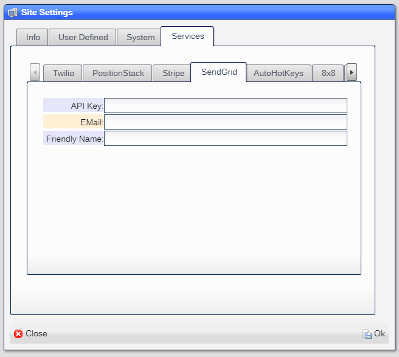

# Services

These are the third party services that NX.Workspace uses.  Use of these services are optional and controlled via
the **Site Settings** tool.

## To access all settings

1) Click on the ***Start*** button
2) Select ***System***
3) Select ***Site Settings***.
4) Select ***Services*** tab

## To access user allowed

1) Click on the ***Start*** button
2) Select ***System***
3) Select ***Allowed Extension***

### Sample allowed


## Twilio

Twilio is used to send and receive SMS and MMS messages and to make and receive phone calls.  To get the information
required visit:

```
https://www.twilio.com/
```

### Setup

You create a Twilio account by clicking [here](https://www.twilio.com/try-twilio),

Once you have done that, you will get ***Account SID, token and phone number*** [here](https://www.comm100.com/livechat/knowledgebase/where-do-i-find-the-twilio-account-sid-auth-token-and-phone-number-sid.html#:~:text=Here%20is%20how%20to%20access%20this%20information%3A%201,can%20find%20the%20SID%20for%20the%20phone%20number.).

You enter the information in your ***Site Settings*** as shown here:



This will link your site with the Twilio services.

### User allowed

You need to include ```?TELE``` as an entry in the ***Allowed*** field for each user that is allowed use of the Twilio interface.

## PositionStack

PositionStack is used to validate addresses and to geocode.  To get the information reqired visit:

```
https://positionstack.com/
```

### Setup 

You create a PositionStack account by clicking [here](https://positionstack.com/).  Follow the instructions on getting an ***API Key***.

Once yoou have done that, enter the ***API Key*** in your ***Site Settings*** as shown here:


Note that the service is free for any intranet based site.  There is a fee for public facing sites that use SSL.

## SendGrid

SendGrid is used to send emails.  To get the information reqired visit:

```
https://sendgrid.com/
```
### Setup

You create a SendGrid account by clicking [here](https://signup.sendgrid.com/),

Once you have done that, you will get ***API Key and EMail address*** .

You enter the information in your ***Site Settings*** as shown here:



This will link your site with the SendGrid services.

### User allowed

You need to include ```?EMAIL``` as an entry in the ***Allowed*** field for each user that is allowed use of the SendGrid interface.

## Stripe

Stripe is used to accept online payments.  To get the information reqired visit:

```
https://stripe.com/
```

## 8x8

8x8 Jitsi is used to create video conferences.  To get the information reqired visit:

```
https://jaas.8x8.vc/
```

## Twitter

Twitter is used to send twits and to geocode.  To get the information reqired visit:

```
https://developer.twitter.com/en
```


[Home](../README.md)
