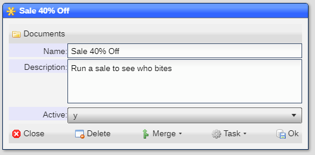
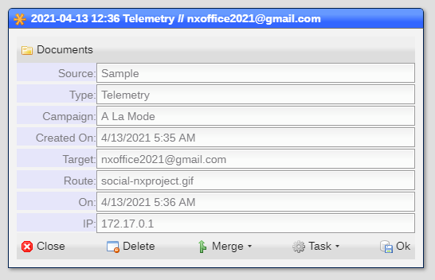
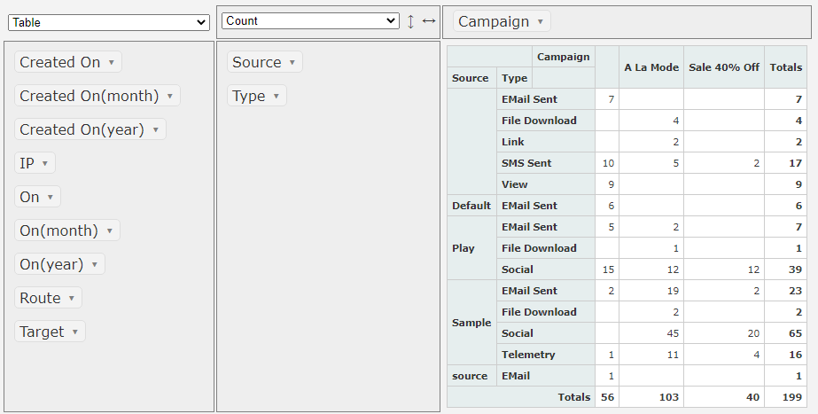

# Telemetry

Telemetry allows for the analysis of ***Web***, ***EMail*** and ***SMS*** campaigns.  

## Enabling telemetry

You enable telemetry ubsing the [Site Settings](README_SITE.md) tool.  In it you will find:


Setting the ***Telemetry*** entry to ***y*** enables the telemetry options.

You also need to include the ``TELEMETRY``` selector for each [user](README_USERS.md) that is allowed access to the telemetry sub-system.

## Campaigns

A campaign is a way to identify a set of telemetry data to a specific objective.  An example is:



## What is telemetry data?

Telemetry data is generated when and ***EMail*** or ***SMS*** is sent to an [account](README_ACCOUNTS.md) or a target ***EMail address*** 
or ***SMS phone number***.  This is ***outbound telemetry***.

***Inbound telemetry*** is generated when the recipient, or viewer in the case of ***Web***, views ***tracked images*** or cicks on ***links***
or ***images***.

For each interaction the folowing data is collectetd:



## Analyzing telemetry data

You can analyze telemetry data using the [analyze](README_T_ANALYZE.md) tool built into NX.Worskpace.  This is an
example of an analysis:



## Privacy laws

Many countries and other govermental entities have rules and regulations that may apply to the information gathered in the telemetry sub-system.
Make sure that you understand and follow these rules and regulations at all times.

## When telemetry is not needed

You do not need to enable telementry if all you want to do is keep track of ***sent*** emails and SMS messages.  This information is part
of each [account](README_ACCOUNTS.md).

[Home](../README.md)
