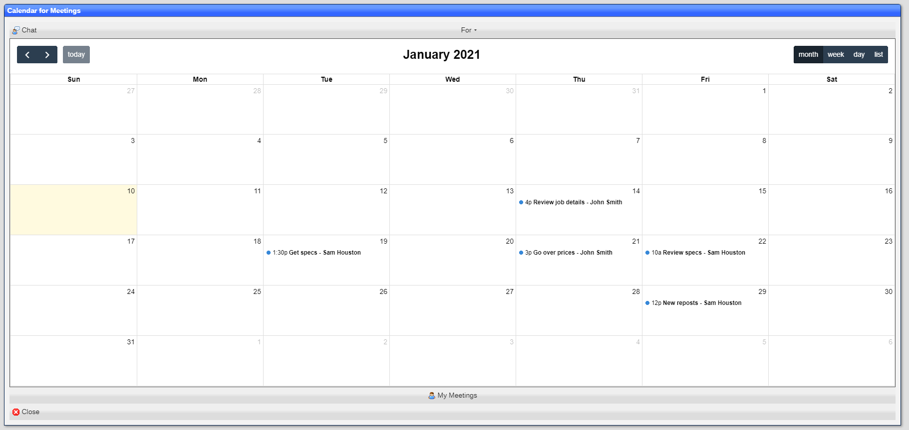
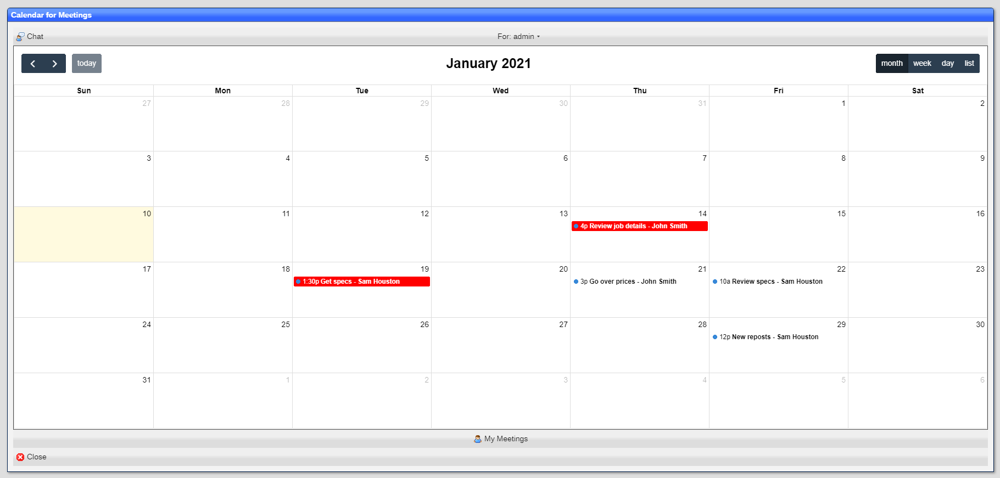
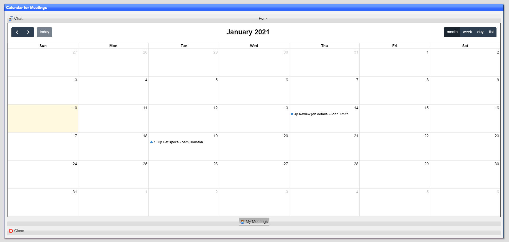

# Calendar

The calendar tool displays the entries for a given ***dataset***:

## Navigating dates

You can change the date range being shown by clikcing on the ***< (previous)*** or ***> (next)*** buttons.
Clicking on the ***today*** button returns to today's date.

The current date is display as the top caption.

Today is shown shaded in a light tan.

## Views

You can change the type of date range by clicking on the ***month***, ***week***, ***day*** or ***list*** buttons.

You can also chnage views by clicking on the day in the ***month*** or ***week*** view.  This will take you to the
***day*** view for the date selected.

## By

If defined, the ***by*** choices are shown in the top toolbar.  Selecting an entry will highlight the events that
match the criteria:

Here we selected ***admin*** in the ***For*** field.

## Pick fields

Pick fields behave the same as the [Pick fields](/README_D_PICK.md):

While this example is using a similar filter to the ***by*** selection above, the difference is that the ***pick filed***
removes all entries that do not match, while the ***by*** does not.

## Rescheduling an event

You can reschedule an event by dragging the event to a new date and/or time. 

## Changing an event

You can display an event by clicking on it.  The underlying object view is shown allowing for changes.  When the object
is saved, the calendar is updated.

[Home](../README.md)
