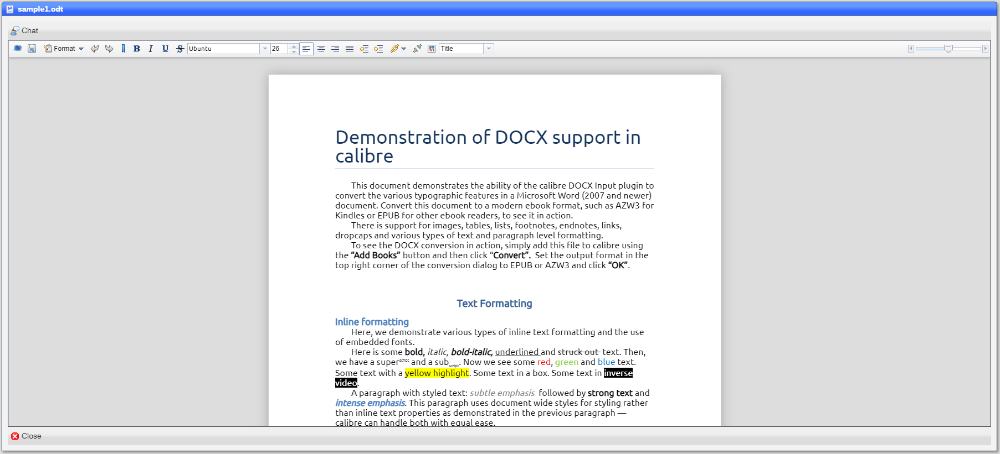
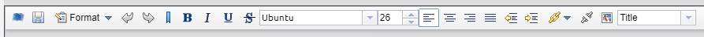

# Editor

The editor allows you to edit ***docx*** documents.  It is invoked when you ***View*** a ***docx*** document:

## Top toolbar

|Label|Meaning|
|-|-|
|Chat|Opens a chat window for the document|

## Shortcuts

|Position|Meaning|
|-|-|
|1|Credits|
|2|Save|
|3|Format|
|4|Undo|
|5|Redo|
|6|Bold|
|7|Italic|
|8|Underscore|
|9|Strikethrough|
|10|Font|
|11|Font size|
|12|Align left|
|13|Align center|
|14|Align right|
|15|Justify|
|16|Indent|
|17|Outdent|
|18|Link|
|19|Unlink|
|20|Insert image|
|21|Style|

## Command bar

|Label|Meaning|
|-|-|
|Close|Closes the view ***without saving any changes***|

[Home](../README.md)
