# Merging

Merging is accomplished by creating ***odt*** documents with embedded merge codes.  This is an example:


Merge codes are field names enclosed in square brackets, as explained un the [Lists and Expressions](/README_LE.md)
***Fields*** section.

When merged, the merge fields are converted to their stored equivalents:


## Types of merge fields

There are two types types of merge fields.

### Source is object

The most common type of merge field is one where the data source is the object being used for the merge.  It is the field
name enclosed in brackets.  It the exmaple above:

```
[name]
```

Is an example of this type of field.

#### Getting the field definition code

You can get the field definition code by right-mouse clicking on any field and selecting the ***Copy field def*** entry:

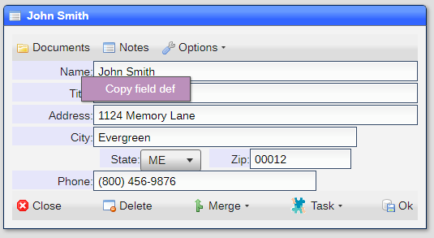

### Source is a setting

When the source is a setting, the ***store field*** format is used.  These are the available stores:

#### Site information

Site information can be merged by using ***[\*sys:settingname]*** as the merge code.  You can get the field definition
code by right-mouse clicking on any field in the [Site Settings](/README_SITE.md) window and selecting the 
***Copy field def*** entry: 

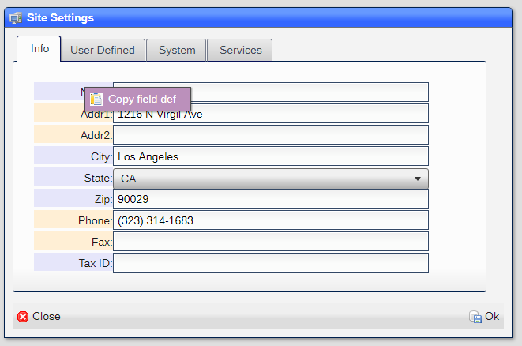

Since not all users have access to the settings, here are the codes for the common ones:

|Field|Code|
|-|-|
|Name|[*sys:name]|
|Addr1|[*sys:addr1]|
|Addr2|[*sys:addr2]|
|City|[*sys:city]|
|State|[*sys:state]|
|Zip|[*sys:zip]|
|Phone|[*sys:phone]|
|Fax|[*sys:fax]|
|Tax ID|[*sys:taxid]|
|User Defined #1|[*sys:udf1]|
|User Defined #2|[*sys:udf2]|
|User Defined #3|[*sys:udf3]|

#### User information

User information can be merged by using ***[\*user:settingname]*** as the merge code.  You can get the field definition
code by right-mouse clicking on any field in the ***user*** window and selecting the 
***Copy field def*** entry: 

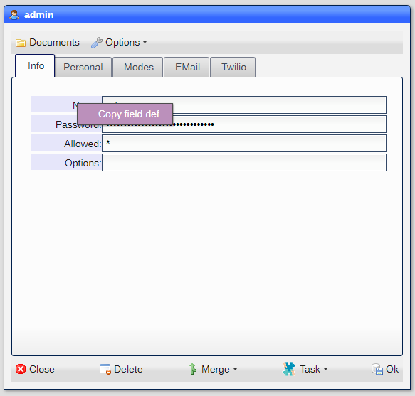

Since not all users have access to the settings, here are the codes for the common ones:

|Field|Code|
|-|-|
|Name|[*user:name]|
|Full name|[*user:dispname]|
|Title|[*user:title]|
|EMail Name|[*user:emailname]|
|Twilio Phone number|[*user:twiliophone]|

## Templates

Templates are accessed via the ***Templates*** button in the ***command bar*** in the ***pick*** window for the dataset.
Clicking on the button displays the window:

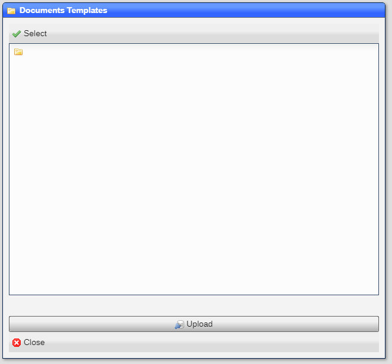

Ypu can upload a template or build from a ***built-in template*** as shown here:

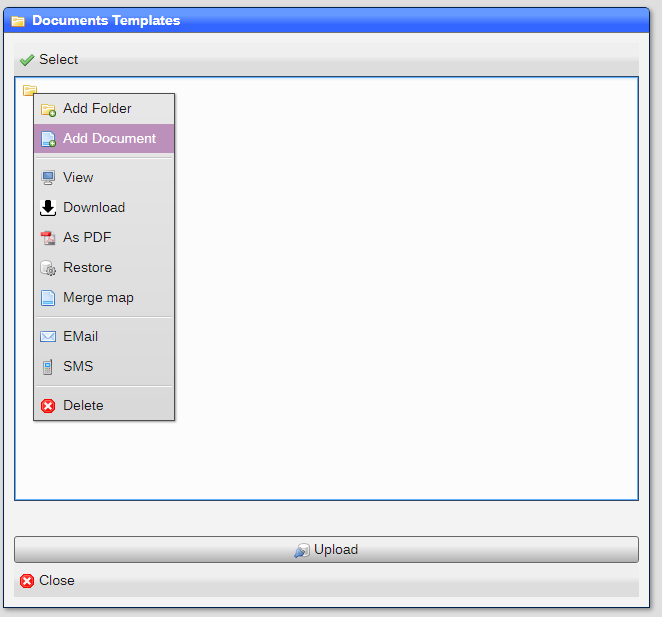

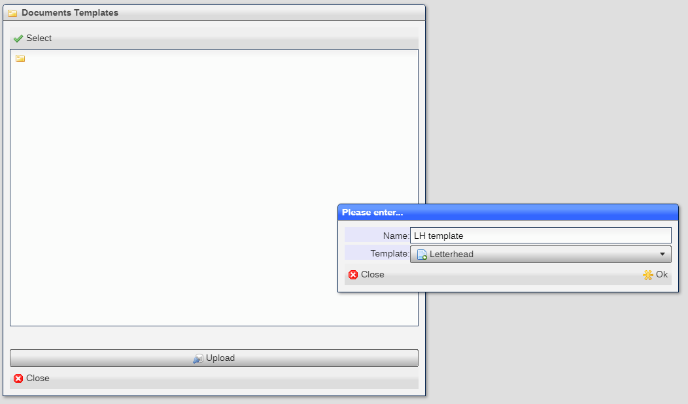

The template is displayed and you can modify it to your needs:


The template is now available for use.

## Merge from object

You can merge from the object by clicking on the ***Merge*** button in the ***command bar*** for the object:

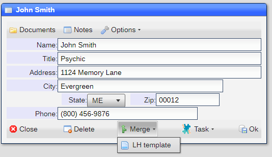

A list of templates is displayed, and by selecting one, it is used to cerate the merged document:


You can further edit the document to fit your needs.  The document is saved as part of the object documents:

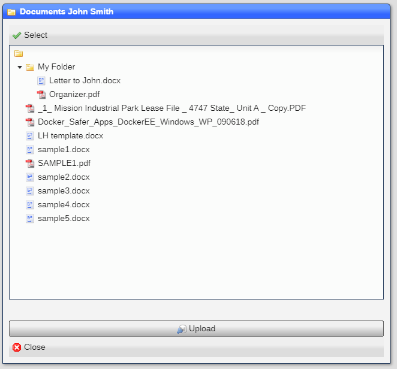

## Merge from documents

You can also merge from the ***Documents*** window of the object by using the ***Add Document*** option from the 
context menu for any ***folder***:

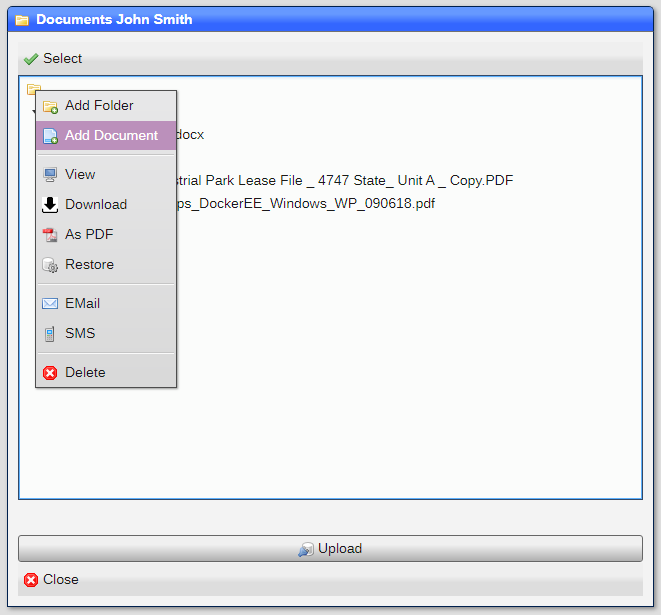

This will prompt for a document name and which template to use:

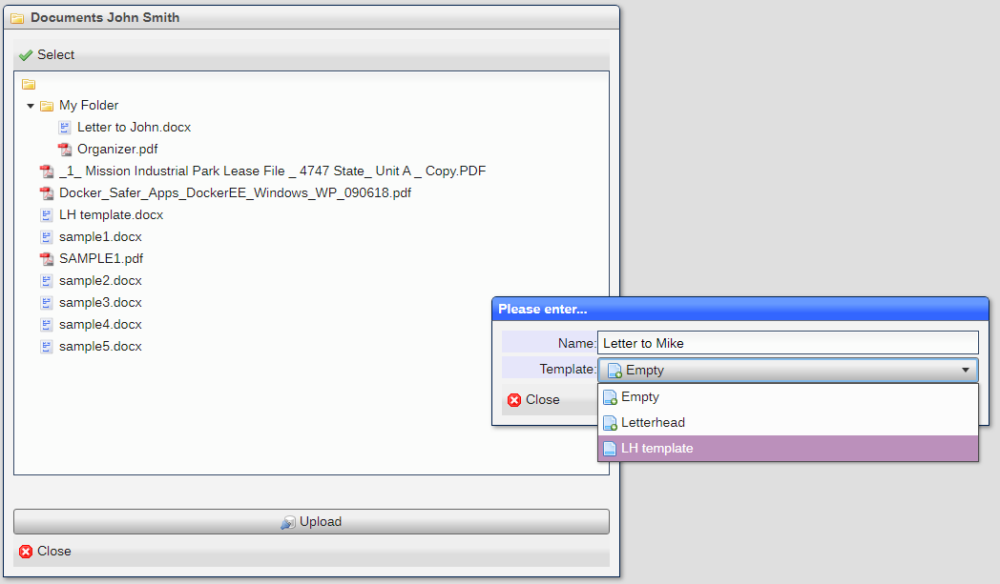

And create the document as before.  The document is left in the ***documents*** area for the object:

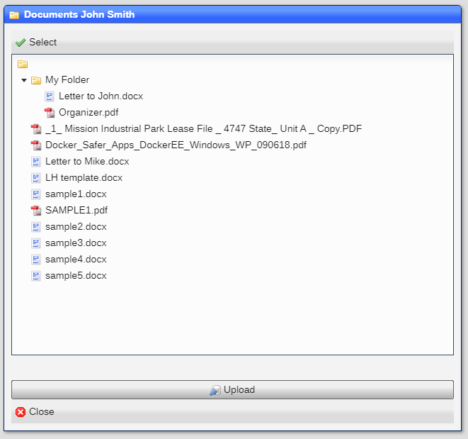

The diffrerences in the two methods above are that while the ***from object*** allows you to create ***document sets***,
the ***from documents*** allow you to name the merged document and place it in a folder.

### Built-in templates

These are the built-in templates:

|Template|Use|
|-|-|
|Empty|An empty document|
|Letterhead|An empty document with letterhead|

## Document sets

Document stes are groups of mergeable documents.  They are created by creating ***folders*** in the ***templates***
***Documents*** window:

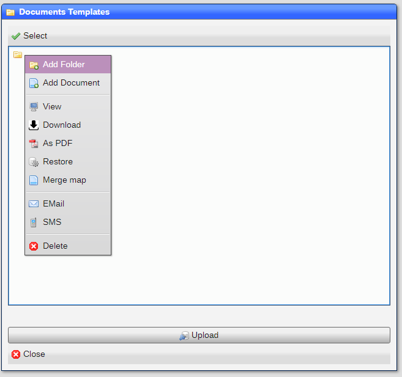

Which prompts for a folder name:


And documents can be added to the folder:

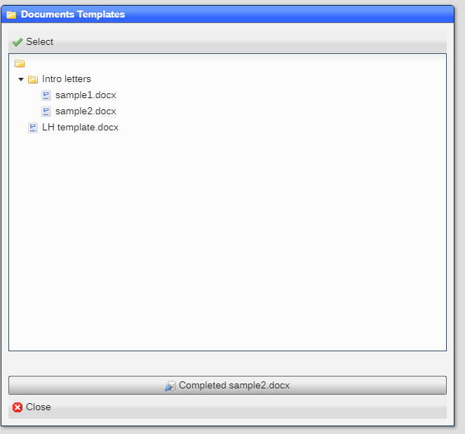

## Extended merge

While the above methodology works well for simple compute/replacement type of merges, an extended merge mode can be used
as a **pre-processing*** step in the merge process.  This uses [directives](README_LE.md) and can include not only the data
in the object, but also data in associated objects.  The overall data structure used varies from object to object and from
dataset to dataset.  In order for you to plan your document merge directives, a ***context*** generating tool is available
in the [documents](README_D_DOCS.md) store viewer.

This is an example of a fairly complex data ***context***:

```
{
  "_id": "608064c9b8156c20153dc912",
  "_desc": "2021-04-20 19:00 - 2920 / ",
  "_ver": "04/21/2021 05:45 PM",
  "billed": "2920.00",
  "code": "54D4317507784EFFBD747BAA4BF9E760",
  "desc": "Generated on 04/21/2021",
  "on": "04/20/2021",
  "_ds": "_billinvoice",
  "_sys": {
    "addr1": "1216 N Virgil Ave",
    "city": "Los Angeles",
    "name": "Demo Site",
    "state": "CA",
    "zip": "90029",
    "officeclose": "01:00 AM",
    "officeopen": "03:00 PM",
    "timezone": "America/Los_Angeles",
    "phone": "(323) 314-1683"
  },
  "_user": {
    "_id": "jose",
    "_desc": "jose",
    "_ver": "04/13/2021 06:16 PM",
    "allowed": "*",
    "name": "jose",
    "openmode": "stack",
    "_ds": "_user",
    "_documents": "/f/ao/_user/jose"
  },
  "acct": {
    "_id": "DD04137F4F860954A1673A2D33407919",
    "_desc": "(323) 314-1683 -  / Client : Patrici Allison",
    "_ver": "04/17/2021 02:43 PM",
    "lastctcout": "04/17/2021 02:43 PM",
    "lastctcoutcmp": "",
    "lastctcoutsource": "",
    "lastctcoutvia": "SMS",
    "name": "(323) 314-1683",
    "tabs": "Info",
    "_ds": "_billaccess",
    "pwd": "",
    "allowed": "",
    "childof": "",
    "billon": "",
    "actual": {
      "_id": "6064e7e96b6697481d348e78",
      "_desc": "Patrici Allison",
      "_ver": "04/15/2021 02:42 PM",
      "ctcvia": "SMS",
      "name": "Patrici Allison",
      "value": "Sales Consultant",
      "access": "(323) 314-1683",
      "_ds": "rolodex",
      "address": "",
      "city": "",
      "state": "",
      "zip": "",
      "phone": "",
      "email": "",
      "_changes": "",
      "_wfisactivity": "",
      "dob": "",
      "dl": "",
      "ophone": "",
      "_documents": []
    },
    "lastin": "",
    "subscribedon": "",
    "optouton": "",
    "lastctcin": "",
    "lastctcinvia": "",
    "lastctcinsource": "",
    "lastctcincmp": "",
    "_documents": []
  },
  "at": {
    "_id": "60770458831c39167522e233",
    "_desc": "2021-04-14 15:03 Car has brakes issues -- ",
    "_ver": "04/18/2021 03:40 AM",
    "datein": "04/14/2021 03:03 PM",
    "desc": "Car has brakes issues",
    "statuson": "04/14/2021 03:03 PM",
    "tabs": "Info",
    "_ds": "order",
    "dateout": "",
    "details": "",
    "assgto": "",
    "promised": "",
    "bill": "",
    "payment": "",
    "paidon": "",
    "status": "",
    "_changes": "",
    "_wfisactivity": "",
    "statuschgd": "",
    "promisedby": "",
    "doneon": "",
    "payon": "",
    "_calstart": "",
    "_parent": {
      "_id": "6076524ad469047aa93356dd",
      "_desc": "876ABC -   ",
      "_ver": "04/14/2021 03:03 PM",
      "plate": "876ABC",
      "state": "CA",
      "_ds": "vehicle",
      "year": "",
      "make": "",
      "model": "",
      "color": "",
      "doors": "",
      "vin": "",
      "eng": "",
      "type": "",
      "series": "",
      "cyl": "",
      "trim": "",
      "trans": "",
      "speed": "",
      "_changes": "",
      "fuel": "",
      "odo": "",
      "_parent": {
        "_id": "6064e7e96b6697481d348e78",
        "_desc": "Patrici Allison",
        "_ver": "04/15/2021 02:42 PM",
        "ctcvia": "SMS",
        "name": "Patrici Allison",
        "value": "Sales Consultant",
        "access": "(323) 314-1683",
        "_ds": "rolodex",
        "address": "",
        "city": "",
        "state": "",
        "zip": "",
        "phone": "",
        "email": "",
        "_changes": "",
        "_wfisactivity": "",
        "dob": "",
        "dl": "",
        "ophone": "",
        "_documents": []
      },
      "_documents": []
    },
    "_documents": [
      {
        "name": "test.odt",
        "path": "ao/order/60770458831c39167522e233/test.odt"
      },
      {
        "name": "test1.odt",
        "path": "ao/order/60770458831c39167522e233/test1.odt"
      }
    ]
  },
  "payment": "",
  "paidon": "",
  "_parent": "",
  "_child": {
    "_billcharge": [
      {
        "_id": "60806492b8156c20153dc8de",
        "_desc": "2021-04-20 124 - Brake replacement @ (323) 314-1683 -  / Client : Patrici Allison",
        "_ver": "04/21/2021 05:45 PM",
        "code": "124",
        "desc": "Brake replacement",
        "disc": "0.00",
        "on": "04/20/2021",
        "price": "260.00",
        "rate": "65.00",
        "total": "260.00",
        "units": "4",
        "invon": "04/21/2021 05:45 PM",
        "_ds": "_billcharge",
        "_documents": []
      },
      {
        "_id": "6080649eb8156c20153dc8ef",
        "_desc": "2021-04-20  - Seats @ (323) 314-1683 -  / Client : Patrici Allison",
        "_ver": "04/21/2021 05:45 PM",
        "desc": "Seats",
        "disc": "0.00",
        "on": "04/20/2021",
        "price": "2400.00",
        "rate": "1200.00",
        "total": "2400.00",
        "units": "2",
        "invon": "04/21/2021 05:45 PM",
        "_ds": "_billcharge",
        "code": "",
        "_documents": []
      },
      {
        "_id": "608064b2b8156c20153dc8fe",
        "_desc": "2021-04-20 124 - Brake replacement @ (323) 314-1683 -  / Client : Patrici Allison",
        "_ver": "04/21/2021 05:45 PM",
        "code": "124",
        "desc": "Brake replacement",
        "disc": "0.00",
        "on": "04/20/2021",
        "price": "260.00",
        "rate": "65.00",
        "total": "260.00",
        "units": "4",
        "invon": "04/21/2021 05:45 PM",
        "_ds": "_billcharge",
        "_documents": []
      }
    ]
  },
  "_documents": [
    {
      "name": "Upload",
      "path": "ao/_billinvoice/608064c9b8156c20153dc912/Upload",
      "items": [
        {
          "name": "POS Chuck v Buakong v Paul Buakong _ Lakthong Buakong 1028795.pdf",
          "path": "ao/_billinvoice/608064c9b8156c20153dc912/Upload/POS Chuck v Buakong v Paul Buakong _ Lakthong Buakong 1028795.pdf"
        }
      ]
    }
  ]
}
```
Using drective ssyntax ```{{_sys.name}}``` would return ***Demo Site^^^.

[Home](../README.md)
