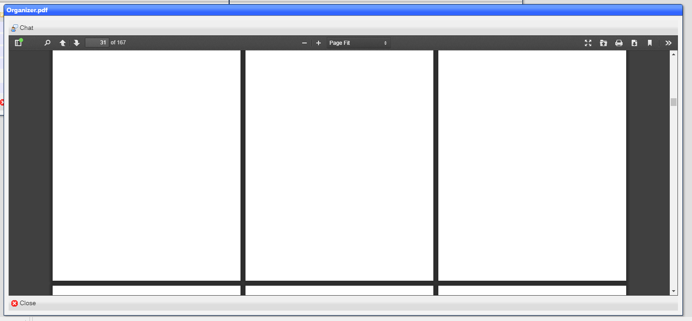

# PDF Viewer

The PDF viewer displays a ***pdf*** document, with multiple viewing options:

## Top toolbar

|Label|Meaning|
|-|-|
|Chat|Opens a chat window for the document|

## Shortcuts

|Icon|Meaning|
|-|-|
||Toggle Sidebar|
||Find in Document|
||Previous Page|
||Next Page|
||Page|
||Zoom Out|
||Zoom In|
||Zoom|
|Switch to Presentation Mode|
||Print|
||Download|
||Go to First Page|
||Go to Last Page|
||Rotate Clockwise|
||Rotate Counterclockwise|
||Enable Text Selection Tool|
||Enable Hand Tool|
||Use Vertical Scrolling|
||Use Horizontal Scrolling|
||Use Wrapped Scrolling|
||Do not join page spreads|
||Join page spreads starting with odd-numbered pages|
||Join page spreads starting with even-numbered pages|
||"Document Properties|

[Home](../README.md)
