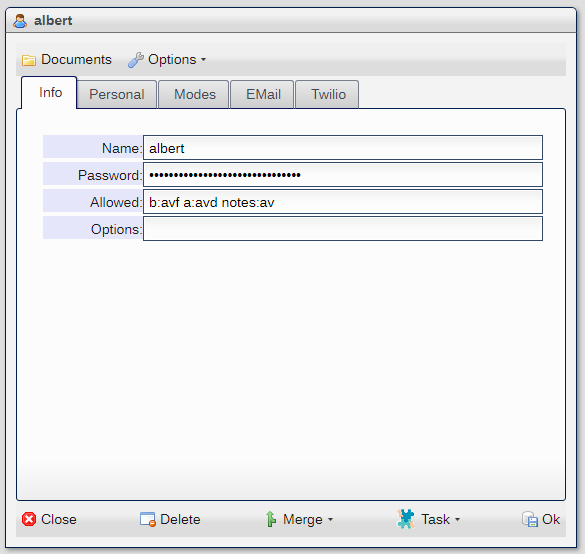
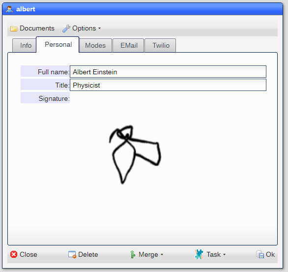
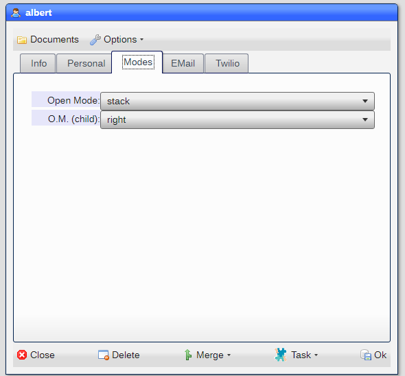
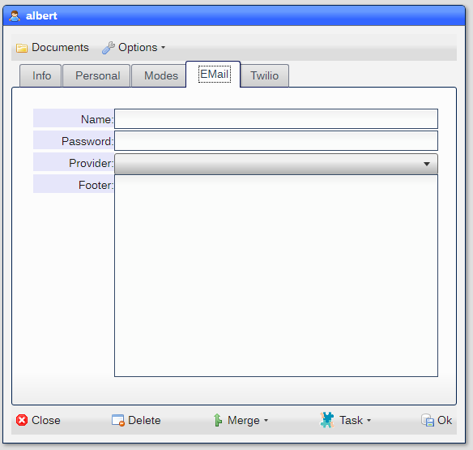
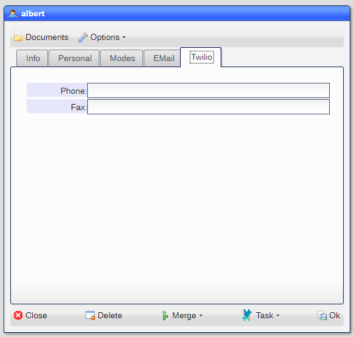
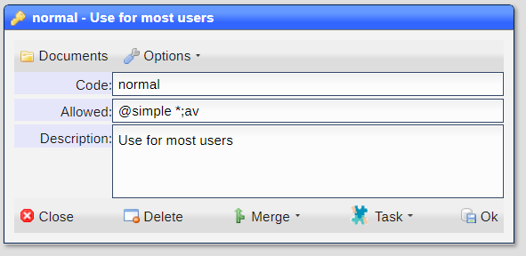

# Users

Access to the site is controlled by the User dataset entries.  Both are similar in that the 
site manager decides on which datasets and tools are available, but users hold more personal information
that is available for processes.

## Site Manager

The site manager is created by the ***first*** login into the site.  Other users and managers can be created by 
the site managers and have access to ***all*** datasets and tools.

## Users

Users are added and modified by accessign the ***User*** dataset:



|Field|Meaning|
|-|-|
|Name|Keyword that is the name used at log in|
|Password|The password used at login (case sensitive)|
|Allowed|The datasets allowed for the user (see below)|
|Option|Options allowed (future)|

---



|Field|Meaning|
|-|-|
|Full Name|The complete name of the user|
|Title|The title|
|Signature|Image of signature|


---



|Field|Meaning|
|-|-|
|Open Mode|Position of the window opened via ***Start*** menu|
|O.M. (child)|Position of child windows|

---



|Field|Meaning|
|-|-|
|Name|The log in name to the EMail service provider|
|Password|Password to the EMail service provider|
|Provider|The EMail service provider|
|Footer|Text to be included at the bottom of the email|

---



|Field|Meaning|
|-|-|
|Phone|Phone number|
|Fax|Fax number|


## Personal information

At the top of the ***Start*** menu, the name and site is displayed.  When the user selects the menu entry,
an abbreviated ***User*** settings window is dsplayed.

## Allowed

The ***Allowed*** field in the ***User*** settings window.  The value in this field must follow certain rules
in order to work properly.  It is a ```list``` which means that is a set of words separated by spaces.

Each word is meant to be the rule that applies to a dataset.

### Rule format

Each rule starts with a dataset name followed by a colon and then the privileges that apply.  It can the be 
followed any number of options for the dataset.

#### Privileges

Privileges are defined as follows:

* ```a``` - Add
* ```v``` - View
* ```x``` - Delete
* ```d``` - Documents
* ```l``` - Templates
* ```m``` - Merge
* ```c``` - Calendar
* ```t``` - Tasks
* ```r``` - Reports
* ```w``` - Workflows
* ```z``` - Analyze
* ```o``` - Organizer

* ```e``` - Erase dataset from Start menu
* ```s``` - Show dataset in Start menu

Include any character for which operation the user is allowed for the dataset.  For example:

```
note:av
```

Tells the system that the user can ***add*** and ***view*** ***notes***.

#### Options

There are four options that can be included for each dataset:

* ```@``` - Use view given
* ```%``` - User is a mamber of the group given
* ```$``` - User is allowed use of the tool given
* ```#``` - Read rules from allowed extension given

A rule can have multiple options, for example:

```
note:av@simple%sales%service
```

Tells the system that the user can ***add*** and ***view*** the ***notes*** dataset and that the ***view***
to be used is the ***simple*** one.  Also that the user is in the ***sales*** and ***service*** groups.

### Macro settings

When a rule is defined without a dataset name, the system will treat the entry as applying to all
dataset entries that follow.  For example:

```
:av client notes
```

Tells the system that the user can ***add*** and ***view*** in the ***client*** and ***notes*** datasets.

### All datasets

Using ***\**** as the dataset name tells the system to include all defined datasets.  This allows for the
definition to auomatical include any new datasets defined after the user ***allowed*** entry has been set
as well a excluging any dataset that may have been deleted.

### Selectors

Selectors are part of the allowed settings but they are defined in a global basis.  For example:

```
?QM
```

Tells the system that the Quick MEssage selector is set.  Each selector controls a particual area or operation
in the system.  The following are defined:

* ```HELP``` - Allow access to online help
* ```EMAIL``` - Allow access to email operations
* ```QUICK``` - Allow for Quick Messages
* ```TELE``` = Allow access to Twilio SMS and Voice
* ```8X8``` - Allow access to 8x8 Jitsi

And a special ones:

* ```ACCT``` - Treat the user as an account
* ```MGR``` - Treat the user as a manager (overrides privacy in datasets)
* ```ALL``` - Allow all access

## Allowed extensions

Any number of ***extensions*** can be created using the ***Allowed Extensions*** dataset found in the
***System*** entry in the ***Start*** menu:



Each entry has the following fields:

* ```Code``` - The keyword that is the name of the extension
* ```Allowed``` - A list of rules
* ```Desc``` - Description

You can then make use of the extension by entering:

```
#normal
```

As the ***allowed*** entry for any user.  If you change the extension, all changes will be applied to the
user when he/she logs in.

## Getting an explanation of what is allowed

You can right mouse click on an ***allowed*** field and select ***Explain*** to get a breakdown on what the
rules given will provide.

## GMail

If you use Google Mail (GMail) as your email service, you need to allow NX.Offie to access it.

* Sign in to Gmail
* Click [here](https://www.google.com/settings/security/lesssecureapps) to access Less Secure App Access in My Account.
* Next to **Allow less secure apps: OFF**, select the toggle switch to turn ```ON```.

The Allow less secure apps setting may not be available for:

* Accounts with 2-Step Verification (2FA) enabled. If 2FA is already enabled on your account, you should create an application-specific 
password and use this password for your application. 
* G Suite users: This setting may not be available if your G Suite administrator has locked less secure app account access. Please 
read the G Suite section below or contact your G Suite administrator for help.
* If you still cannot access your account with an app password, visit 
the [Display Unlock Captcha](https://accounts.google.com/DisplayUnlockCaptcha) page and click ```Continue``` to remove the security block.


[Home](../README.md)
