# Visuals

During development we found the work by [Chris Evans' Clean theme](https://github.com/sqville/ville.Clean) and have integrated
it into NX.Workspace.  Most of the screen captures were done under the old theme which is still reachable by using:

```
<Your site URL>?_theme=nx
```

The following themes are available: ***classic***, ***modern*** and ***nx***.

## Webtop

This is the webtop (web based desktop) using the ***clean*** or default theme:

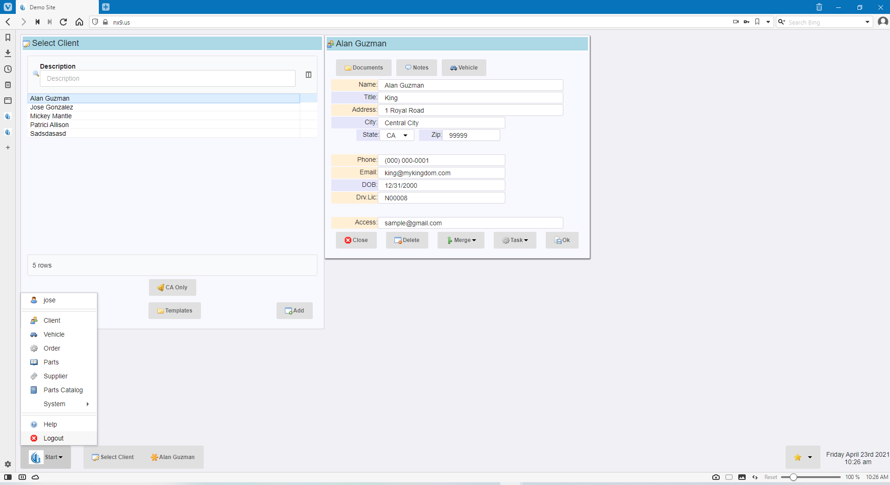

And this is the original or ***nx*** theme:

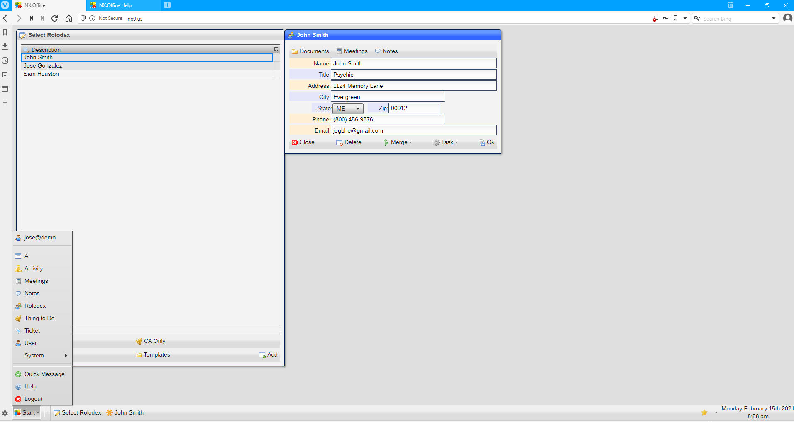

The desktop is the working surface of each user in the site.  It is composed of a ***taskbar*** at the bottom 
of the desktop and can display any number of windows.

### Taskbar

The taskbar has three sections:

#### Start menu

Access to all the datastes and tools is done via the ***Start*** button:

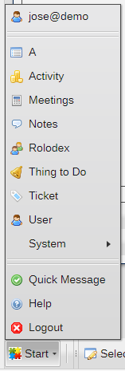

With the exception of ceratin ***accounts*** which may have an empty Start menu, all Start menus will
have a ***user name*** entry at the top and a ***Logout*** entry at the bottom.

#### Pinned menu

The Pinned button is also used to access ***pinned** items.

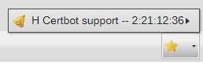

#### Window taskbar button

Each active window in the desktop is assigned a button in the taskbar:

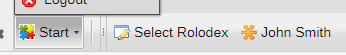

Note that the button displays the window title and icon.  The active window is shown with a ***gold asterisk***.

Clicking on the window taskbar button activates the window.  If the buton for the active wimdow is
clicked, the window will be hidden.  Clicking on a hidden window's taskbar button hows the window.

## Window

The window is the basic display element in the NX.Workspace system.  

All windows have the same format, with each item being optional, except for the ***workarea*** and 
***command bar***.

This is an example of a ***data window***:

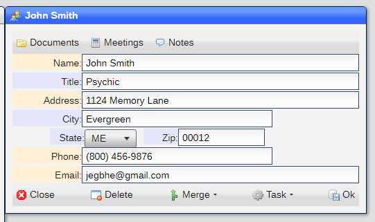

It has a ***top toolbar***, ***workarea*** and ***command bar***.

And this is an example of a ***pick list***:

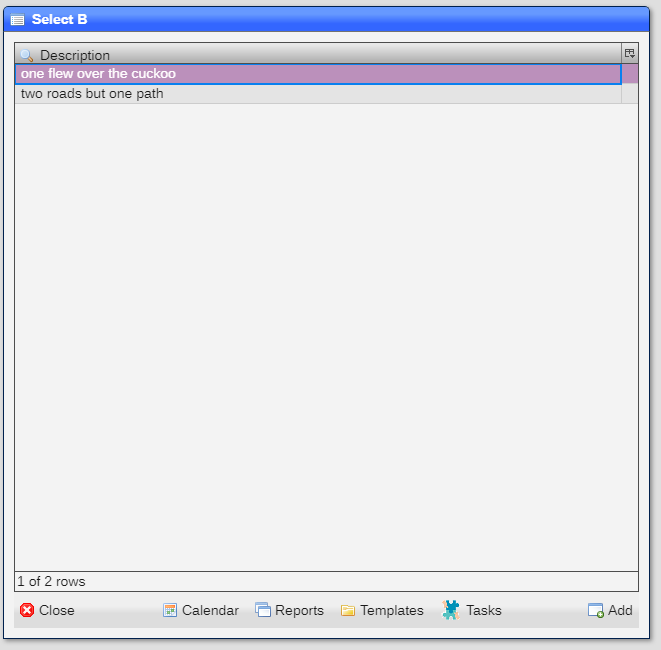

Note that all it has is the ***workarea*** and the ***command bar***.

### Top toolbar

The top toolbar is used to display functions that are specific to the window being shown.

### Workarea

The workarea holds all the data displayed in the window.  It is made up of ***fields***.

#### Field

A field holds a piece of information, like a name or a list of items.  Labels are optional for each field, although is 
common practice toinclude them.

##### Context menu

Context menus are used throught the system to display functions specific to the ***field*** or 
***button*** being selected.  You display the context menu by right-mouce clicking on the item.

You can tell which fields have context menus by the color of their labels, which change from the normal **lavender** color.

This is an example of a context menu:

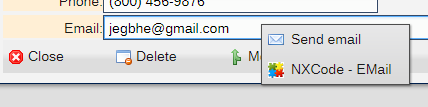

### Bottom toolbar

The bottom toolbar is used to display functions that are specific to the window being shown.

### Command bar

The command bar is used for major functions.  The following buttons are normally shown in the
command bar:

* ```Close``` - Closes the window
* ```Ok``` - Accepts the request
* ```Save``` - Saves any changes and closes the window

### System command bar

The system command bar is very uncommon.  Here is an example of the system command bar:

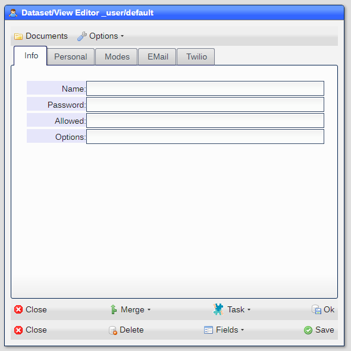

In this case, the ***command bar*** is ***non-operational*** and shown so you can see the ***data***
window as it would be generated.

## Modal windows

Modal windows display on top of all other windows and force the user to make a decision before continuing
the process.  This is an example:

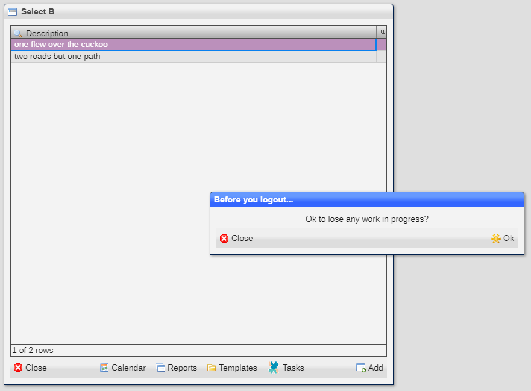

This particular window displays if you try to logout while other windows are open.

## Login

When the site is accessed and no user information is detected, the login window is shown:

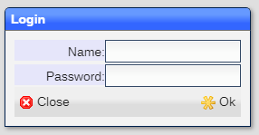

Once you have given the proper credentials, a ***notification*** is displayed:

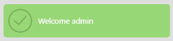

## Theming

You can change some of the theme options in [Site Settings](README_SITE.md) ***System***/***Theming*** tab.  you need to enter 
key/value pairs, for example:

```
winBackgroundColor: "#F0FFFF"
winCaptionColor: "#FFEBCD"
```

|Key|Default|Meaning|
|-|-|-|
|desktopColor|"#f0f0f5"|Background color of the desktop|
|desktopUrl|""|URL to an image file to serve as desktop background|
|winBackgroundColor|"#F8F8FF"|Background color of the window|
|winCaptionColor|"#ADD8E6"|Window caption background color|
|winCaptionFontSize|18|Size of the caption font|
|winCaptionPadding|4|Padding size for caption|
|winCaptionIconPadding|8|Padding size for the caption icon|
|buttonFontSize|12|Size of the button font|
|buttonGap|2|Size of gap between buttons|
|toolbarGap|2|Size of the toolbar separator|

Each option is enetered in its own line and you must use double quotes where indicated.

[Home](../README.md)
